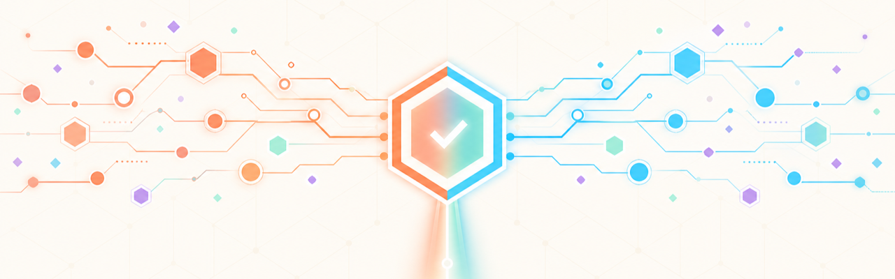
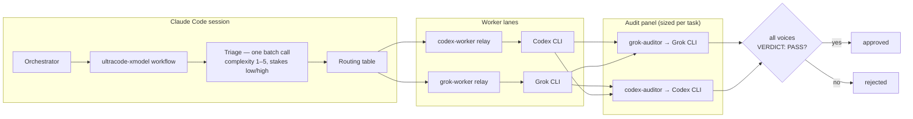
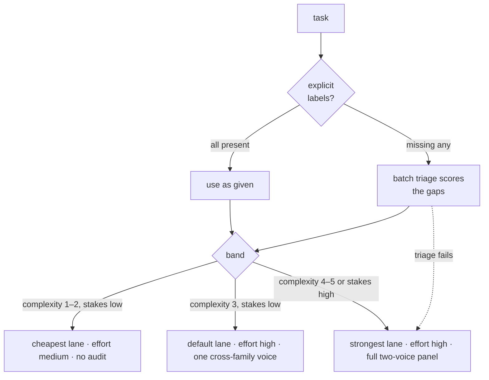
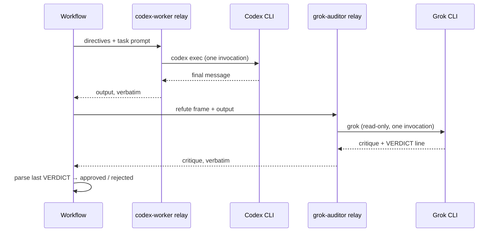

<p align="center">
  
</p>

# ultracode-xmodel

**Cross-model task execution for Claude Code.** Run self-contained tasks on
external frontier models through the Codex and Grok CLIs, route each task's
lane, reasoning effort, and audit depth from its measured complexity, and
gate every substantial result behind an adversarial refute panel drawn from
a different model family.

Built by [FORMM Labs](https://formm.mx/labs?ref=ultracode-xmodel) — the research
division of [FORMM Creative Group](https://formm.mx). We build AI tooling
for every operational aspect of our business, and we put those same tools
to work on our larger goal: transforming how the construction and
development industry designs, quotes, and delivers projects.

[](https://github.com/pablogcloud/ultracode-xmodel/actions/workflows/ci.yml)

## Why

- **Orthogonal blind spots.** Models trained on different data miss
  different bugs. Work produced by one family is audited by another, and an
  item is approved only when every audit voice fails to refute it.
- **Effort where it pays.** A one-line mechanical change does not need a
  frontier model at maximum effort plus a two-voice review. Tasks are
  scored once for complexity and stakes, then routed: cheap lanes and no
  audit for trivial work, strongest lane and a full panel for high-stakes
  work.
- **Your orchestrating session stays cheap.** The calling Claude Code
  session spends tokens on one batch triage call and thin relays; all heavy
  reasoning runs on your Codex/Grok subscriptions.

## How it works



Each task flows through three phases:

1. **Triage.** Tasks that arrive without routing labels are scored in a
   single batch call: complexity 1–5 and stakes `low`/`high`. Labels you
   set explicitly are never overridden.
2. **Work.** Each task runs on its assigned lane — a thin relay agent
   writes the prompt to a file and makes exactly one CLI invocation at the
   assigned reasoning effort, returning the model's output verbatim.
3. **Audit.** Results are challenged by auditors instructed to refute the
   work and end with a machine-parseable `VERDICT:` line. The panel size
   comes from the routing band; approval requires every voice to PASS.

### Effort routing



| Band | Lane | Worker effort | Audit |
|---|---|---|---|
| complexity 1–2, stakes low | cheapest | medium | skipped |
| complexity 3, stakes low | default | high | single cross-family voice |
| complexity 4–5 **or** stakes high | strongest | high | two-voice panel, all must PASS |

High stakes always gets the full panel, whatever the complexity. If the
triage call fails, affected tasks escalate to the strongest lane and the
full panel — routing failures raise rigor, never lower it. Every routing
decision is logged before dispatch.

### One task's lifecycle



## Use cases

Where the combination of external execution, effort routing, and cross-model
audit pays off:

- **Parallel batches of self-contained work.** A list of independent tasks —
  implement these eight helper functions with tests, add docstrings across
  these modules, generate these fixtures — runs concurrently on external
  models while your Claude session only orchestrates.
- **High-stakes changes that warrant a second and third opinion.** A
  security-sensitive edit (auth, payments, a schema migration) is produced by
  one model family and adversarially reviewed by another before you trust it —
  the same cross-model refutation that shows its worth on real bugs.
- **Mixed workloads where effort should not be uniform.** A batch with a few
  trivial renames and a couple of genuinely hard pieces: triage routes the
  cheap ones to a cheap lane with no audit and reserves the strongest lane and
  full panel for what actually needs it, instead of paying maximum effort on
  everything.
- **Reducing single-model blind spots.** When you do not fully trust one
  model's output, an independent family is tasked with refuting it; approval
  requires every voice to fail to break it.
- **Keeping your main quota for orchestration.** The orchestrating session
  spends tokens on one triage call and thin relays; the heavy reasoning runs
  on your external Codex/Grok subscriptions.
- **Fan-out research and audits.** Analyze these N documents independently,
  review these modules for a specific bug class — each item self-contained,
  each verifiable.

It is **not** a fit for tightly-coupled work that needs shared context across
tasks, interactive/real-time turns, or anything where the task cannot be made
self-contained — the external CLI cannot see your Claude session.

## Requirements

- Claude Code 2.1 or later with the Workflow tool (in a session, ask
  Claude to list its tools — Workflow must be among them).
- [Codex CLI](https://github.com/openai/codex) and/or the xAI
  [Grok CLI](https://docs.x.ai/build/overview) (install:
  `curl -fsSL https://x.ai/cli/install.sh | bash`, verify:
  `grok --version`), installed and authenticated. Both give you the full
  cross-model panel; one alone runs in a reduced single-voice mode.
- Node ≥ 18 only if you want to run the test suite:
  `node test/harness.mjs && bash test/check.sh && bash test/run-mock-checks.sh`.

## Install

**As a plugin (recommended):**

```
/plugin marketplace add pablogcloud/ultracode-xmodel
/plugin install ultracode-xmodel
```

**Manual:** clone the repo and run `./install.sh` (user-wide) or
`./install.sh --project` (current repo only).

New agents and skills register at session start — restart your Claude Code
session after installing.

Then verify your environment:

```
bin/xmodel-doctor
```

## Quickstart

Ask Claude Code to use the `ultracode-xmodel` skill, or invoke the Workflow
tool directly with
`scriptPath: "<install dir>/skills/ultracode-xmodel/ultracode-xmodel.js"`
and the args below (plugin installs: the script lives in the plugin's
skill directory; the skill prints its base directory when it loads):

```json
{
  "tasks": [
    { "id": "summarize-readme", "prompt": "Read /path/to/repo/README.md and return a 5-bullet summary of what the project does. Read-only.", "dir": "/path/to/repo" },
    { "id": "audit-auth",       "prompt": "Review /path/to/repo/src/auth/session.ts for token-lifetime and invalidation bugs. Report findings with file:line references.", "stakes": "high" }
  ]
}
```

`summarize-readme` is a trivial read-only task — triage scores it low, so it
runs on the cheap lane with no audit. `audit-auth` is explicitly high stakes —
strongest lane, full two-voice panel. (An in-place, `workspace-write` change to
working code triages *high* by design — the routing treats modifying a working
system as high-stakes, so such tasks always get the panel.)

Each result returns `output`, the routing that was applied, per-voice audit
verdicts, and `approved: true | false | null` (null = audit skipped).

## Configuration

Lanes, models, role pointers, and audit voices live in the `CONFIG` block
at the top of `skills/ultracode-xmodel/ultracode-xmodel.js`, and any subset
can be overridden per-run via `args.config`:

```json
{ "config": { "lanes": { "codex-high": { "directives": { "MODEL": "a-newer-model" } } } } }
```

Adding a lane is two steps: copy an existing relay agent in `agents/` and
adjust its CLI command, then add one entry to `CONFIG.lanes` with the
agent's name, family, and default directives. Auditors work the same way
via `CONFIG.auditors`.

## Degraded modes

The workflow states its compromises in the run log rather than hiding
them: a missing CLI family drops the panel to one voice (and says so), a
single-voice audit that cannot find a cross-family auditor says it used a
same-family voice, roles healed onto an available lane are logged, and
skipped audits are logged per task. On a single-CLI machine, run
`xmodel-doctor --config` and pass its output as `config` so the routing
table matches what is installed:

```
$ bin/xmodel-doctor --config
{ "lanes": { "grok": null }, "auditors": { "grok": null } }
```

Pass that object as the `config` value in your Workflow args.

## Troubleshooting & security

See [docs/TROUBLESHOOTING.md](docs/TROUBLESHOOTING.md) and
[docs/SECURITY.md](docs/SECURITY.md).

## License

MIT
