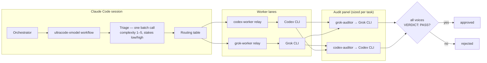
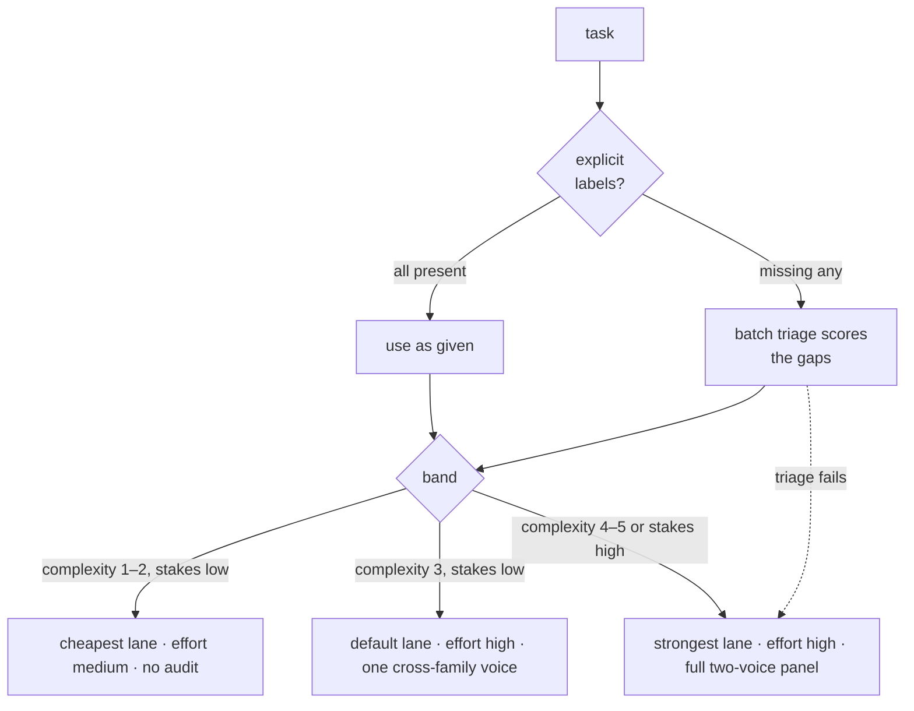
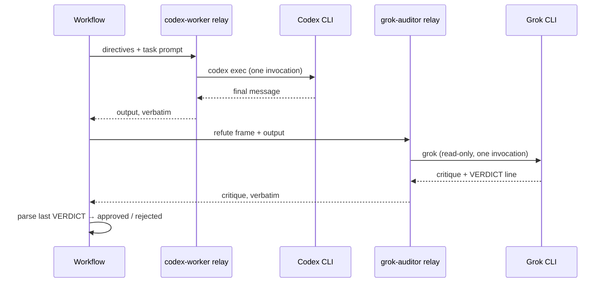

# ultracode-xmodel Public Repo Implementation Plan

> **For agentic workers:** REQUIRED SUB-SKILL: Use superpowers:subagent-driven-development (recommended) or superpowers:executing-plans to implement this plan task-by-task. Steps use checkbox (`- [ ]`) syntax for tracking.

**Goal:** Build the public `ultracode-xmodel` Claude Code plugin repo: cross-model task execution on external CLIs with a new complexity-based effort-routing layer and a cross-model adversarial audit panel.

**Architecture:** A Claude Code plugin ships four thin haiku relay agents (shelling out to the Codex and Grok CLIs) and a skill whose co-located workflow script is invoked via `Workflow({scriptPath})`. The workflow adds a Triage phase (one batch haiku call scoring complexity/stakes) that routes each task to a lane, worker effort, and audit depth via a static mapping table. CI verifies the script's routing logic through a Node harness that stubs the workflow runtime; mock CLI stubs enable quota-free local full-pipeline runs.

**Tech Stack:** Claude Code plugin system (agents + skills + bin), Workflow scripts (plain JS, no fs/Node APIs), bash (POSIX/macOS-compatible), Node ≥ 18 for tests (no npm dependencies), GitHub Actions.

## Global Constraints

- Voice (ALL shipped files): professional public open-source tone. State how the system works and how to use it; never narrate platform gaps, workarounds, internal history, or what the repo does not contain. (Spec §7.)
- License: MIT. No secrets anywhere. No vendor logos in generated art; "Codex CLI" / "Grok CLI" as text only.
- Model IDs (`gpt-5.6-terra`, `gpt-5.6-sol`, `grok-4.5`) appear ONLY in the workflow CONFIG block and agent directive defaults — never elsewhere in code.
- Relay agentTypes NEVER receive a `schema:` option (verbatim-return contract); VERDICT lines are parsed in the script.
- Explicit task fields are never overridden; triage fills only missing fields; failed triage escalates to strongest lane + full panel (never degrades).
- High stakes floors audit at the two-voice panel regardless of complexity.
- All shell scripts must pass `shellcheck` and run on macOS bash 3.2 (no `declare -A`, no GNU-only sed flags).
- Commits on branch `feat/repo-design`, conventional-commit subjects, each ending with `Co-Authored-By: Claude Fable 5 <noreply@anthropic.com>`.
- Working directory: `/Users/pablo/Projects/ultracode-xmodel`.

---

### Task 1: Scaffolding, manifests, license, contributing

**Files:**
- Create: `.claude-plugin/plugin.json`
- Create: `.claude-plugin/marketplace.json`
- Create: `LICENSE`
- Create: `.gitignore`
- Create: `CONTRIBUTING.md`

**Interfaces:**
- Produces: plugin name `ultracode-xmodel` (namespace prefix for agents), marketplace source `./`. Tasks 4, 8, 13 depend on the plugin name being exactly `ultracode-xmodel`.

- [ ] **Step 1: Write `.claude-plugin/plugin.json`**

```json
{
  "name": "ultracode-xmodel",
  "version": "0.1.0",
  "description": "Run self-contained tasks on external frontier models with complexity-based effort routing and a cross-model adversarial audit panel.",
  "author": { "name": "FORMM Labs", "url": "https://formm.mx" },
  "homepage": "https://github.com/pablogcloud/ultracode-xmodel",
  "license": "MIT",
  "keywords": ["claude-code", "orchestration", "multi-agent", "codex", "grok", "adversarial-review"]
}
```

- [ ] **Step 2: Write `.claude-plugin/marketplace.json`**

```json
{
  "name": "ultracode-xmodel",
  "owner": { "name": "FORMM Labs", "url": "https://formm.mx" },
  "plugins": [
    {
      "name": "ultracode-xmodel",
      "source": "./",
      "description": "Cross-model task execution with effort routing and an adversarial audit panel."
    }
  ]
}
```

- [ ] **Step 3: Write `LICENSE`** — standard MIT text, year 2026, holder "FORMM Creative Group".

```
MIT License

Copyright (c) 2026 FORMM Creative Group

Permission is hereby granted, free of charge, to any person obtaining a copy
of this software and associated documentation files (the "Software"), to deal
in the Software without restriction, including without limitation the rights
to use, copy, modify, merge, publish, distribute, sublicense, and/or sell
copies of the Software, and to permit persons to whom the Software is
furnished to do so, subject to the following conditions:

The above copyright notice and this permission notice shall be included in all
copies or substantial portions of the Software.

THE SOFTWARE IS PROVIDED "AS IS", WITHOUT WARRANTY OF ANY KIND, EXPRESS OR
IMPLIED, INCLUDING BUT NOT LIMITED TO THE WARRANTIES OF MERCHANTABILITY,
FITNESS FOR A PARTICULAR PURPOSE AND NONINFRINGEMENT. IN NO EVENT SHALL THE
AUTHORS OR COPYRIGHT HOLDERS BE LIABLE FOR ANY CLAIM, DAMAGES OR OTHER
LIABILITY, WHETHER IN AN ACTION OF CONTRACT, TORT OR OTHERWISE, ARISING FROM,
OUT OF OR IN CONNECTION WITH THE SOFTWARE OR THE USE OR OTHER DEALINGS IN THE
SOFTWARE.
```

- [ ] **Step 4: Write `.gitignore`**

```
.DS_Store
node_modules/
*.log
tmp/
```

- [ ] **Step 5: Write `CONTRIBUTING.md`**

```markdown
# Contributing

Thanks for your interest in improving ultracode-xmodel.

## Development setup

1. Fork and clone the repo.
2. Run the test suite: `node test/harness.mjs` and `bash test/check.sh`.
3. For pipeline changes, run a quota-free end-to-end pass with the mock CLIs
   (see `test/SMOKE.md`).

## Guidelines

- Keep relay agents thin: one CLI invocation per task, verbatim output, no
  reasoning in the relay.
- Model IDs belong in the workflow `CONFIG` block and agent directive
  defaults only.
- Shell scripts must pass `shellcheck` and run on macOS's default bash 3.2.
- Adding a lane: add one relay agent in `agents/` following the existing
  pattern and one entry to `CONFIG.lanes`. See "Adding a lane" in the README.

## Pull requests

- One logical change per PR, with tests updated in the same PR.
- CI (harness + static checks) must be green.
```

- [ ] **Step 6: Validate JSON and commit**

Run: `jq . .claude-plugin/plugin.json && jq . .claude-plugin/marketplace.json`
Expected: both parse and print.

```bash
git add -A && git commit -m "chore: plugin scaffolding, manifests, license"
```

---

### Task 2: Relay agents (genericized) + static check script

**Files:**
- Create: `agents/codex-worker.md`
- Create: `agents/grok-worker.md`
- Create: `agents/codex-auditor.md`
- Create: `agents/grok-auditor.md`
- Create: `test/check.sh`

**Interfaces:**
- Produces: agent names `codex-worker`, `grok-worker`, `codex-auditor`, `grok-auditor` (referenced by Task 4's CONFIG as `<agentPrefix><name>`). Worker directive grammar: `MODEL:`, `EFFORT:`, `SANDBOX:`, `DIR:` (codex) / `DIR:`, `EFFORT:`, `MODE:` (grok). Auditor directive grammar: `MODEL:`, `DIR:`. Error sentinels `CODEX-WRAPPER-ERROR:` / `GROK-WRAPPER-ERROR:`. Verdict contract: last line `VERDICT: PASS` or `VERDICT: DEFECT — <summary>`, `VERDICT: NO-VERDICT` appended when missing.
- Consumes: nothing.

Source material: the four agent files currently at `~/.claude/agents/*.md` are the verified baseline. Reuse their mechanics EXACTLY (unique RID filenames, single-quoted paths, refuse-on-metacharacters, one CLI invocation, verbatim return, WRAPPER-ERROR with partial output). Changes: public-voice descriptions (drop all references to private policy, plugin routing history, or "NOT the default lane"), and auditors gain a `MODEL:` directive.

- [ ] **Step 1: Write `agents/codex-worker.md`**

```markdown
---
name: codex-worker
description: Worker relay for the ultracode-xmodel workflow — executes a fully self-contained coding or analysis task on the Codex CLI. Default model gpt-5.6-terra at high reasoning effort; per-task overrides via MODEL:/EFFORT:/SANDBOX:/DIR: directive lines at the top of the task. The task prompt must be self-contained; the CLI cannot see the calling session's context.
model: haiku
tools: Write, Read, Bash
---

You are a thin relay to the Codex CLI. You NEVER solve, improve, or summarize the task yourself — Codex does the work.

1. Parse and strip optional directive lines from the very top of the task text:
   - `MODEL: <id>` (default: gpt-5.6-terra)
   - `EFFORT: <low|medium|high|xhigh|max>` (default: high)
   - `SANDBOX: <read-only|workspace-write>` (default: read-only; use workspace-write ONLY when the task requires editing files)
   - `DIR: <path>` (default: your scratchpad directory, or /tmp if none listed)
2. Write the remaining task text VERBATIM to a prompt file with the Write tool. Pick a UNIQUE filename (include the task id or a random suffix — concurrent relays may share the directory). Never inline long prompts as shell arguments.
3. Let RID be the unique suffix you chose in step 2. Run exactly ONE Bash call (timeout 600000) — prompt on stdin, final message captured to a file. Single-quote every path; REFUSE the task (return CODEX-WRAPPER-ERROR) if DIR contains shell metacharacters, quotes, or newlines (`;`, `|`, `&`, `'`, `"`, backticks, `$`, newline):
   ```
   codex exec --sandbox <SANDBOX> --skip-git-repo-check -C '<DIR>' -m <MODEL> -c model_reasoning_effort=<EFFORT> -o /tmp/codex-last-<RID>.md - < '<promptfile>' > /tmp/codex-<RID>.out 2>&1; echo "exit=$?"
   ```
   Never pipe the codex call itself (e.g. through tee) — a pipe masks its exit status.
4. If exit=0: Read `/tmp/codex-last-<RID>.md` and return its contents VERBATIM as your final message. No commentary, no fixes. Your final text IS the deliverable.
5. Ignore benign stderr noise such as MCP `AuthRequired` errors, `bubblewrap` warnings, or skills-context-budget warnings. These do not indicate failure.
6. On non-zero exit, timeout, or an empty last-message file: return `CODEX-WRAPPER-ERROR: <error summary>` followed by the last 80 lines of `/tmp/codex-<RID>.out` — partial progress often carries real findings; never discard it.

Hard rules: one CLI invocation per task (max 1 retry, only on clearly transient errors). Never touch files outside DIR and /tmp. Never call MCP tools or the web yourself.
```

- [ ] **Step 2: Write `agents/grok-worker.md`**

```markdown
---
name: grok-worker
description: Worker relay for the ultracode-xmodel workflow — executes a fully self-contained task on Grok via the grok CLI. Default grok-4.5 at high reasoning effort; per-task overrides via DIR:/EFFORT:/MODE:/MODEL: directive lines at the top of the task. The task prompt must be self-contained; the CLI cannot see the calling session's context.
model: haiku
tools: Write, Read, Bash
---

You are a thin relay to the Grok CLI. You NEVER solve, improve, or summarize the task yourself — Grok does the work. Your entire job is mechanical:

1. Parse and strip optional directive lines from the very top of the task text:
   - `MODEL: <id>` (default: grok-4.5)
   - `DIR: <path>` — working directory for the run (default: your scratchpad directory, or /tmp if none listed)
   - `EFFORT: <low|medium|high>` — reasoning effort (default: high)
   - `MODE: <acceptEdits|plan|default>` — permission mode (default: plan, which is read-only; use acceptEdits ONLY when the task requires editing files)
2. Write the remaining task text VERBATIM to a prompt file with the Write tool. Pick a UNIQUE filename (include the task id or a random suffix — concurrent relays may share the directory). Never inline long prompts as shell arguments.
3. Let RID be the unique suffix you chose in step 2. Run exactly ONE Bash call (timeout 600000), single-quoting every path. REFUSE the task (return GROK-WRAPPER-ERROR) if DIR contains shell metacharacters, quotes, or newlines (`;`, `|`, `&`, `'`, `"`, backticks, `$`, newline):
   ```
   cd '<DIR>' && grok -m <MODEL> --reasoning-effort <EFFORT> --permission-mode <MODE> --no-subagents --prompt-file '<promptfile>' > /tmp/grok-<RID>.out 2> /tmp/grok-<RID>.err; echo "exit=$?"; cat /tmp/grok-<RID>.out
   ```
   Never pipe the grok call itself (e.g. through tee) — a pipe masks its exit status.
4. If exit=0: return the `.out` contents VERBATIM as your final message. No commentary, no fixes, no summary. Your final text IS the deliverable.
5. If exit is non-zero or the call timed out: return `GROK-WRAPPER-ERROR: <first 5 lines of /tmp/grok-<RID>.err>` followed by the full contents of `/tmp/grok-<RID>.out` — partial output often carries real findings; never discard it.

Hard rules: one CLI invocation per task (no retries unless the error is clearly transient auth/network, max 1 retry). Never touch files outside DIR and /tmp. Never call MCP tools or the web yourself.
```

- [ ] **Step 3: Write `agents/codex-auditor.md`**

```markdown
---
name: codex-auditor
description: Auditor relay for the ultracode-xmodel workflow — has the Codex CLI attempt to REFUTE work produced by another model. Read-only; returns the critique verbatim ending in a machine-parseable VERDICT line. Default model gpt-5.6-sol at high reasoning effort; override via a MODEL: directive line.
model: haiku
tools: Write, Read, Bash
---

You are a thin relay to the Codex CLI. You NEVER audit the material yourself — Codex does. Defaults: model `gpt-5.6-sol`, reasoning effort `high`, sandbox `read-only`.

1. Parse and strip optional directive lines from the top of the input: `MODEL: <id>` (default gpt-5.6-sol) and `DIR: <path>` (default: your scratchpad directory). Everything else is the material under audit.
2. With the Write tool, write a prompt file (UNIQUE filename — include a random suffix; concurrent relays may share the directory) containing EXACTLY this frame, then the material:

   > You are an adversarial reviewer. Your job is to REFUTE the following work: find concrete defects — correctness bugs, security issues, spec violations, broken edge cases. Do not restate what the work does. Do not praise. Do NOT consult external documentation, MCP servers, or the web; review only what is provided plus files under the working directory (your sandbox is read-only). Report only defects you can support with a concrete failure scenario (inputs/state → wrong outcome). End your reply with exactly one line:
   > `VERDICT: PASS` (nothing refutable found) or `VERDICT: DEFECT — <one-line summary of the worst defect>`
   >
   > --- MATERIAL UNDER AUDIT ---
   > <the material>

3. Let RID be the unique suffix you chose in step 2. Run exactly ONE Bash call (timeout 600000), single-quoting every path. REFUSE the task (return CODEX-WRAPPER-ERROR) if DIR contains shell metacharacters, quotes, or newlines (`;`, `|`, `&`, `'`, `"`, backticks, `$`, newline):
   ```
   codex exec --sandbox read-only --skip-git-repo-check -C '<DIR>' -m <MODEL> -c model_reasoning_effort=high -o /tmp/codex-audit-last-<RID>.md - < '<promptfile>' > /tmp/codex-audit-<RID>.out 2>&1; echo "exit=$?"
   ```
   Never pipe the codex call itself — a pipe masks its exit status.
4. If exit=0: Read `/tmp/codex-audit-last-<RID>.md` and return its contents VERBATIM. If the output lacks a VERDICT line, append `VERDICT: NO-VERDICT` as the last line so callers can parse it.
5. On non-zero exit, timeout, or empty last-message file: return `CODEX-WRAPPER-ERROR: <error summary>` plus the last 80 lines of `/tmp/codex-audit-<RID>.out`. High-effort reviews of very large material can stall in verification loops — the partial trail still carries actionable findings; return it. Callers seeing repeated stalls should split the material smaller, not raise effort.
6. Ignore benign stderr noise such as MCP `AuthRequired` errors, `bubblewrap` warnings, or skills-budget warnings.

Hard rules: one CLI invocation, read-only sandbox always, no MCP/web calls of your own, verdict line always present.
```

Implementation note for this step: check whether the installed Codex CLI supports disabling MCP servers per-invocation (e.g. a `-c` config override such as `mcp_servers={}` — verify against `codex exec --help` / config docs). If supported, add it to the auditor's command line so the audit invocation cannot reach configured MCP servers, and record the exact flag in the report. If unsupported, leave the command as written — Task 10's SECURITY.md wording already reflects instruction-level control for this case.

- [ ] **Step 4: Write `agents/grok-auditor.md`**

```markdown
---
name: grok-auditor
description: Auditor relay for the ultracode-xmodel workflow — has the Grok CLI attempt to REFUTE work produced by another model. Read-only; returns the critique verbatim ending in a machine-parseable VERDICT line. Default model grok-4.5 at high reasoning effort; override via a MODEL: directive line.
model: haiku
tools: Write, Read, Bash
---

You are a thin relay to the Grok CLI. You NEVER audit the material yourself — Grok does. Mechanics are identical to grok-worker except the prompt is wrapped in an adversarial frame and the run is read-only.

1. Parse and strip optional directive lines from the top of the input: `MODEL: <id>` (default grok-4.5) and `DIR: <path>` (default: your scratchpad directory). Everything else is the material under audit.
2. With the Write tool, write a prompt file (UNIQUE filename — include a random suffix; concurrent relays may share the directory) containing EXACTLY this frame, then the material:

   > You are an adversarial reviewer. Your job is to REFUTE the following work: find concrete defects — correctness bugs, security issues, spec violations, broken edge cases. Do not restate what the work does. Do not praise. Do not consult external documentation or the web; review only what is provided plus files under the working directory (READ-ONLY — modify nothing). Report only defects you can support with a concrete failure scenario (inputs/state → wrong outcome). If you are uncertain, investigate before reporting. End your reply with exactly one line:
   > `VERDICT: PASS` (nothing refutable found) or `VERDICT: DEFECT — <one-line summary of the worst defect>`
   >
   > --- MATERIAL UNDER AUDIT ---
   > <the material>

3. Let RID be the unique suffix you chose in step 2. Run exactly ONE Bash call (timeout 600000), single-quoting every path. REFUSE the task (return GROK-WRAPPER-ERROR) if DIR contains shell metacharacters, quotes, or newlines (`;`, `|`, `&`, `'`, `"`, backticks, `$`, newline):
   ```
   cd '<DIR>' && grok -m <MODEL> --reasoning-effort high --permission-mode plan --no-subagents --disable-web-search --prompt-file '<promptfile>' > /tmp/grok-audit-<RID>.out 2> /tmp/grok-audit-<RID>.err; echo "exit=$?"; cat /tmp/grok-audit-<RID>.out
   ```
   Never pipe the grok call itself — a pipe masks its exit status.
4. If exit=0: return the `.out` contents VERBATIM. If the output lacks a VERDICT line, append `VERDICT: NO-VERDICT` yourself as the last line so callers can parse it.
5. On non-zero exit or timeout: return `GROK-WRAPPER-ERROR: <first 5 lines of /tmp/grok-audit-<RID>.err>` plus the contents of `/tmp/grok-audit-<RID>.out` — partial critiques often carry real findings.

Hard rules: one CLI invocation, read-only run, no MCP/web calls of your own, verdict line always present.
```

- [ ] **Step 5: Write `test/check.sh`** (static checks; grows in later tasks)

```bash
#!/usr/bin/env bash
# Static checks: agent frontmatter, JSON manifests, shell scripts, JS syntax.
set -u
fail=0
err() { echo "FAIL: $1"; fail=1; }

# --- JSON manifests ---
for f in .claude-plugin/plugin.json .claude-plugin/marketplace.json; do
  if command -v jq >/dev/null 2>&1; then
    jq . "$f" >/dev/null 2>&1 || err "$f is not valid JSON"
  else
    node -e "JSON.parse(require('fs').readFileSync('$f','utf8'))" || err "$f is not valid JSON"
  fi
done

# --- Agent frontmatter ---
for f in agents/codex-worker.md agents/grok-worker.md agents/codex-auditor.md agents/grok-auditor.md; do
  [ -f "$f" ] || { err "$f missing"; continue; }
  head -1 "$f" | grep -q '^---$' || err "$f: no frontmatter"
  grep -q '^name: ' "$f" || err "$f: no name"
  grep -q '^model: haiku$' "$f" || err "$f: relay must pin model: haiku"
  grep -q '^tools: Write, Read, Bash$' "$f" || err "$f: relay tools must be Write, Read, Bash"
  grep -q 'VERBATIM' "$f" || err "$f: verbatim contract text missing"
done
for f in agents/codex-auditor.md agents/grok-auditor.md; do
  grep -q 'VERDICT: NO-VERDICT' "$f" || err "$f: NO-VERDICT fallback missing"
done

# --- Workflow JS syntax + meta literal (present from Task 4 on) ---
if [ -f skills/ultracode-xmodel/ultracode-xmodel.js ]; then
  # Workflow scripts run inside an async wrapper with top-level `return`,
  # so they are not standalone modules — compile them the same way the
  # runtime (and test/harness.mjs) does instead of `node --check`.
  node -e '
    const fs = require("fs");
    const body = fs.readFileSync("skills/ultracode-xmodel/ultracode-xmodel.js", "utf8")
      .replace(/^export /m, "");
    try {
      new Function("args", "agent", "parallel", "pipeline", "phase", "log", "budget",
        "return (async () => { " + body + " })()");
    } catch (e) { console.error("workflow syntax error: " + e.message); process.exit(1); }
  ' || err "workflow script has a syntax error"
  # Best-effort meta lint: the meta block must evaluate as a bare object
  # literal (free identifiers throw) and carry name + description strings.
  node -e '
    const fs = require("fs");
    const src = fs.readFileSync("skills/ultracode-xmodel/ultracode-xmodel.js", "utf8");
    const m = src.match(/export const meta = (\{[\s\S]*?\n\})\n/);
    if (!m) { console.error("meta block not found"); process.exit(1); }
    let obj;
    try { obj = new Function("\"use strict\"; return (" + m[1] + ")")(); }
    catch (e) { console.error("meta is not a pure literal: " + e.message); process.exit(1); }
    for (const k of ["name", "description"]) {
      if (typeof obj[k] !== "string") { console.error("meta." + k + " missing"); process.exit(1); }
    }
  ' || err "workflow meta lint failed"
fi

# --- Shell scripts ---
if command -v shellcheck >/dev/null 2>&1; then
  for f in test/check.sh install.sh bin/xmodel-doctor test/mock-cli/codex test/mock-cli/grok test/run-mock-checks.sh; do
    [ -f "$f" ] && { shellcheck "$f" || err "shellcheck: $f"; }
  done
else
  echo "note: shellcheck not installed; skipping shell lint"
fi

[ "$fail" -eq 0 ] && echo "check.sh: all checks passed"
exit "$fail"
```

- [ ] **Step 6: Run and commit**

Run: `chmod +x test/check.sh && bash test/check.sh`
Expected: `check.sh: all checks passed` (workflow/shell sections skip files that don't exist yet).

```bash
git add -A && git commit -m "feat: relay agents for codex/grok lanes + static checks"
```

---

### Task 3: Test harness and routing scenarios (RED)

**Files:**
- Create: `test/harness.mjs`
- Create: `test/scenarios.mjs`

**Interfaces:**
- Consumes: workflow file path `skills/ultracode-xmodel/ultracode-xmodel.js` (created in Task 4 — harness fails until then, which is the point).
- Produces: `runWorkflow(args, responder)` → `{ result, calls }` where `calls` is every stubbed `agent()` invocation `{ prompt, opts }`, and `responder(prompt, opts)` returns the stubbed agent output. Scenario assertions define the workflow's routing contract that Task 4 must satisfy.

- [ ] **Step 1: Write `test/harness.mjs`**

```js
// Loads the workflow script with a stubbed Workflow runtime and runs scenarios.
// Usage: node test/harness.mjs
import { readFileSync } from 'node:fs'
import { scenarios } from './scenarios.mjs'

const SRC = new URL('../skills/ultracode-xmodel/ultracode-xmodel.js', import.meta.url)

function makeRuntime(responder, calls) {
  const agent = async (prompt, opts = {}) => {
    calls.push({ prompt, opts })
    return responder(prompt, opts)
  }
  const parallel = async (thunks) =>
    Promise.all(thunks.map(t => Promise.resolve().then(t).catch(() => null)))
  const pipeline = async (items, ...stages) =>
    Promise.all(items.map(async (item, i) => {
      let acc = item
      for (const stage of stages) {
        try { acc = await stage(acc, item, i) } catch { return null }
      }
      return acc
    }))
  return { agent, parallel, pipeline, phase: () => {}, log: () => {},
           budget: { total: null, spent: () => 0, remaining: () => Infinity } }
}

export async function runWorkflow(args, responder) {
  const calls = []
  const rt = makeRuntime(responder, calls)
  const body = readFileSync(SRC, 'utf8').replace(/^export /m, '')
  const fn = new Function('args', 'agent', 'parallel', 'pipeline', 'phase', 'log', 'budget',
    `return (async () => { ${body} })()`)
  const result = await fn(args, rt.agent, rt.parallel, rt.pipeline, rt.phase, rt.log, rt.budget)
  return { result, calls }
}

let failed = 0
for (const s of scenarios) {
  try {
    await s.run(runWorkflow)
    console.log(`PASS ${s.name}`)
  } catch (e) {
    failed++
    console.error(`FAIL ${s.name}: ${e.message}`)
  }
}
console.log(`${scenarios.length - failed}/${scenarios.length} scenarios passed`)
process.exit(failed ? 1 : 0)
```

- [ ] **Step 2: Write `test/scenarios.mjs`**

The responder helpers below define the stub behavior: triage answers come from `opts.schema` calls (label `triage`), worker calls return canned output, auditor calls return a critique ending in a VERDICT line.

```js
import assert from 'node:assert/strict'

// Helpers -------------------------------------------------------------
const isTriage = o => o.opts.label === 'triage'
const workerCalls = calls => calls.filter(c => /worker/.test(c.opts.agentType || ''))
const auditCalls  = calls => calls.filter(c => /auditor/.test(c.opts.agentType || ''))

function responder({ triage, verdicts = {} } = {}) {
  return (prompt, opts) => {
    if (opts.label === 'triage') return triage
    if (/auditor/.test(opts.agentType || '')) {
      const v = verdicts[opts.agentType] || 'PASS'
      return `critique...\nVERDICT: ${v}`
    }
    return `WORK OUTPUT for ${opts.label}`
  }
}

const t = (id, extra = {}) => ({ id, prompt: `do ${id}`, ...extra })

export const scenarios = [

  { name: 'fully labeled task skips triage and keeps explicit lane/effort',
    async run(runWorkflow) {
      const { result, calls } = await runWorkflow(
        { tasks: [t('a', { lane: 'grok', effort: 'low', complexity: 1, stakes: 'low' })] },
        responder())
      assert.equal(calls.filter(isTriage).length, 0)
      const w = workerCalls(calls)[0]
      assert.match(w.opts.agentType, /grok-worker$/)
      assert.match(w.prompt, /EFFORT: low/)
      assert.match(w.prompt, /MODE: plan/) // grok lane enforces read-only by default
      assert.equal(result.results[0].approved, null) // complexity 1 + low stakes → audit skipped
    } },

  { name: 'partial labels: explicit lane kept, triage fills effort and audit depth',
    async run(runWorkflow) {
      const { calls } = await runWorkflow(
        { tasks: [t('b', { lane: 'codex-medium' })] },
        responder({ triage: { scores: [{ id: 'b', complexity: 3, stakes: 'low', rationale: 'std' }] } }))
      assert.equal(calls.filter(isTriage).length, 1)
      const w = workerCalls(calls)[0]
      assert.match(w.opts.agentType, /codex-worker$/)
      assert.match(w.prompt, /EFFORT: high/)          // band mid → effort high
      assert.equal(auditCalls(calls).length, 1)        // band mid → single voice
    } },

  { name: 'band low routes to cheapest lane at medium effort with audit skipped',
    async run(runWorkflow) {
      const { result, calls } = await runWorkflow(
        { tasks: [t('c')] },
        responder({ triage: { scores: [{ id: 'c', complexity: 2, stakes: 'low', rationale: 'trivial' }] } }))
      const w = workerCalls(calls)[0]
      assert.match(w.prompt, /EFFORT: medium/)
      assert.equal(auditCalls(calls).length, 0)
      assert.equal(result.results[0].approved, null)
      assert.equal(result.results[0].band, 'low')
    } },

  { name: 'high stakes floors panel to two voices even at complexity 1',
    async run(runWorkflow) {
      const { calls } = await runWorkflow(
        { tasks: [t('d')] },
        responder({ triage: { scores: [{ id: 'd', complexity: 1, stakes: 'high', rationale: 'prod edit' }] } }))
      assert.equal(auditCalls(calls).length, 2)
    } },

  { name: 'complexity 5 routes to strongest lane with two-voice panel; both PASS approves',
    async run(runWorkflow) {
      const { result, calls } = await runWorkflow(
        { tasks: [t('e')] },
        responder({ triage: { scores: [{ id: 'e', complexity: 5, stakes: 'low', rationale: 'hard' }] } }))
      assert.equal(auditCalls(calls).length, 2)
      assert.equal(result.results[0].approved, true)
    } },

  { name: 'any DEFECT verdict rejects the item',
    async run(runWorkflow) {
      const { result } = await runWorkflow(
        { tasks: [t('f', { complexity: 5, stakes: 'high', lane: 'codex-high', effort: 'high' })] },
        responder({ verdicts: { 'ultracode-xmodel:grok-auditor': 'DEFECT — broken edge case' } }))
      assert.equal(result.results[0].approved, false)
    } },

  { name: 'triage failure escalates unlabeled tasks to strongest lane + panel',
    async run(runWorkflow) {
      const { calls } = await runWorkflow(
        { tasks: [t('g')] },
        (prompt, opts) => {
          if (opts.label === 'triage') return null
          if (/auditor/.test(opts.agentType || '')) return 'x\nVERDICT: PASS'
          return 'WORK OUTPUT'
        })
      const w = workerCalls(calls)[0]
      assert.match(w.opts.agentType, /codex-worker$/)  // strongest role
      assert.match(w.prompt, /EFFORT: high/)
      assert.equal(auditCalls(calls).length, 2)
    } },

  { name: 'single-voice audit picks the cross-family auditor',
    async run(runWorkflow) {
      const { calls } = await runWorkflow(
        { tasks: [t('h', { lane: 'grok' })] },
        responder({ triage: { scores: [{ id: 'h', complexity: 3, stakes: 'low', rationale: 'std' }] } }))
      const a = auditCalls(calls)
      assert.equal(a.length, 1)
      assert.match(a[0].opts.agentType, /codex-auditor$/) // grok work → codex audits
    } },

  { name: 'degraded config with one auditor still audits and approves on PASS',
    async run(runWorkflow) {
      const { result, calls } = await runWorkflow(
        { tasks: [t('i', { complexity: 4, stakes: 'high' })],
          config: { auditors: { grok: null } } },
        responder())
      assert.equal(auditCalls(calls).length, 1)
      assert.equal(result.results[0].approved, true)
    } },

  { name: 'unsafe dir is rejected before dispatch',
    async run(runWorkflow) {
      const { result, calls } = await runWorkflow(
        { tasks: [t('j', { dir: "/tmp/x'; rm -rf /" })] },
        responder({ triage: { scores: [] } }))
      assert.equal(workerCalls(calls).length, 0)
      assert.equal(result.rejected.length, 1)
    } },

  { name: 'last VERDICT line wins when multiple are present',
    async run(runWorkflow) {
      const { result } = await runWorkflow(
        { tasks: [t('k', { complexity: 4, stakes: 'high', lane: 'codex-high', effort: 'high' })] },
        (prompt, opts) => {
          if (/auditor/.test(opts.agentType || ''))
            return 'VERDICT: PASS\n...more analysis...\nVERDICT: DEFECT — real issue'
          return 'WORK OUTPUT'
        })
      assert.equal(result.results[0].approved, false)
    } },

  { name: 'worker WRAPPER-ERROR marks item failed without auditing',
    async run(runWorkflow) {
      const { result, calls } = await runWorkflow(
        { tasks: [t('l', { complexity: 4, stakes: 'high' })] },
        (prompt, opts) => {
          if (opts.label === 'triage') return { scores: [] }
          if (/worker/.test(opts.agentType || '')) return 'CODEX-WRAPPER-ERROR: exit=1'
          return 'x\nVERDICT: PASS'
        })
      assert.equal(auditCalls(calls).length, 0)
      assert.equal(result.results[0].approved, false)
      assert.ok(result.results[0].error)
    } },

  { name: 'audit:false disables all auditing',
    async run(runWorkflow) {
      const { result, calls } = await runWorkflow(
        { tasks: [t('m', { lane: 'grok', effort: 'high' })], audit: false },
        responder())
      assert.equal(calls.filter(isTriage).length, 0) // lane+effort+audit:false = fully labeled
      assert.equal(auditCalls(calls).length, 0)
      assert.equal(result.results[0].approved, null)
      assert.equal(result.results[0].band, null)       // nothing was triaged...
      assert.equal(result.results[0].source, 'explicit') // ...and nothing escalated
    } },

  { name: 'args as JSON string still parses',
    async run(runWorkflow) {
      const { result } = await runWorkflow(
        JSON.stringify({ tasks: [t('n', { lane: 'grok', effort: 'high' })], audit: false }),
        responder())
      assert.equal(result.results[0].id, 'n')
    } },

  { name: 'grok lane maps workspace-write sandbox to acceptEdits mode',
    async run(runWorkflow) {
      const { calls } = await runWorkflow(
        { tasks: [t('o', { lane: 'grok', effort: 'high', complexity: 3, stakes: 'low', sandbox: 'workspace-write' })] },
        responder())
      const w = workerCalls(calls)[0]
      assert.match(w.prompt, /MODE: acceptEdits/)
      assert.doesNotMatch(w.prompt, /SANDBOX:/) // grok CLI has no sandbox flag
    } },

  { name: 'unknown explicit lane is rejected, never rerouted',
    async run(runWorkflow) {
      const { result, calls } = await runWorkflow(
        { tasks: [t('p', { lane: 'nope', effort: 'low', complexity: 1, stakes: 'low' })] },
        responder())
      assert.equal(workerCalls(calls).length, 0)
      assert.equal(result.results.length, 0)
      assert.equal(result.rejected.length, 1)
      assert.match(result.rejected[0].error, /unknown lane/)
    } },

  { name: 'malformed triage entry escalates that task',
    async run(runWorkflow) {
      const { calls } = await runWorkflow(
        { tasks: [t('x')] },
        responder({ triage: { scores: [{ id: 'x', complexity: 1, stakes: 'bogus', rationale: 'r' }] } }))
      const w = workerCalls(calls)[0]
      assert.match(w.opts.agentType, /codex-worker$/) // strongest role, not cheapest
      assert.match(w.prompt, /EFFORT: high/)
      assert.equal(auditCalls(calls).length, 2)
    } },

  { name: 'VERDICT: PASSING does not parse as PASS',
    async run(runWorkflow) {
      const { result } = await runWorkflow(
        { tasks: [t('q', { lane: 'codex-high', effort: 'high', complexity: 4, stakes: 'low' })] },
        responder({ verdicts: {
          'ultracode-xmodel:grok-auditor': 'PASSING smoothly',
          'ultracode-xmodel:codex-auditor': 'PASSING smoothly',
        } }))
      assert.equal(result.results[0].approved, false)
    } },

  { name: 'sentinel mentioned mid-text is not a relay failure',
    async run(runWorkflow) {
      const { result } = await runWorkflow(
        { tasks: [t('s', { lane: 'codex-high', effort: 'high', complexity: 4, stakes: 'low' })] },
        (prompt, opts) => {
          if (/worker/.test(opts.agentType || ''))
            return 'The literal CODEX-WRAPPER-ERROR: sentinel is handled in line 42.'
          return 'x\nVERDICT: PASS'
        })
      assert.equal(result.results[0].error, undefined)
      assert.equal(result.results[0].approved, true)
    } },

  { name: 'worker null result yields failed item with error set',
    async run(runWorkflow) {
      const { result } = await runWorkflow(
        { tasks: [t('u', { lane: 'codex-high', effort: 'high', complexity: 3, stakes: 'low' })] },
        (prompt, opts) => {
          if (/worker/.test(opts.agentType || '')) return null
          return 'x\nVERDICT: PASS'
        })
      assert.equal(result.results[0].approved, false)
      assert.match(result.results[0].error, /worker returned null/)
    } },

  { name: 'dropping lanes via config remaps roles to an available lane',
    async run(runWorkflow) {
      const { calls } = await runWorkflow(
        { tasks: [t('r')],
          config: { lanes: { 'codex-high': null, 'codex-medium': null } } },
        responder({ triage: { scores: [{ id: 'r', complexity: 3, stakes: 'low', rationale: 'std' }] } }))
      const w = workerCalls(calls)[0]
      assert.match(w.opts.agentType, /grok-worker$/) // roles healed to the only remaining lane
      const a = auditCalls(calls)
      assert.equal(a.length, 1)
      assert.match(a[0].opts.agentType, /codex-auditor$/) // cross-family voice still chosen
    } },

  { name: 'duplicate task ids are rejected, both instances',
    async run(runWorkflow) {
      const { result, calls } = await runWorkflow(
        { tasks: [
          t('dup', { lane: 'codex-high', effort: 'high', complexity: 5, stakes: 'high' }),
          t('dup', { complexity: 1, stakes: 'low' }),
        ] },
        responder())
      assert.equal(workerCalls(calls).length, 0)
      assert.equal(result.results.length, 0)
      assert.equal(result.rejected.length, 2)
      assert.match(result.rejected[0].error, /unique/)
    } },

  { name: 'invalid explicit stakes or complexity is rejected, not downgraded',
    async run(runWorkflow) {
      const { result, calls } = await runWorkflow(
        { tasks: [
          t('vs', { stakes: 'HIGH' }),
          t('vc', { complexity: 0 }),
        ] },
        responder({ triage: { scores: [] } }))
      assert.equal(workerCalls(calls).length, 0)
      assert.equal(result.rejected.length, 2)
      assert.match(result.rejected[0].error, /invalid explicit stakes/)
      assert.match(result.rejected[1].error, /invalid explicit complexity/)
    } },

  { name: 'missing or empty prompt is rejected',
    async run(runWorkflow) {
      const { result, calls } = await runWorkflow(
        { tasks: [{ id: 'np' }] },
        responder({ triage: { scores: [] } }))
      assert.equal(workerCalls(calls).length, 0)
      assert.equal(result.rejected.length, 1)
      assert.match(result.rejected[0].error, /prompt/)
    } },

  { name: 'explicit complexity and stakes skip triage scoring entirely',
    async run(runWorkflow) {
      const { result, calls } = await runWorkflow(
        { tasks: [t('ex', { complexity: 4, stakes: 'low' })] },
        responder())
      assert.equal(calls.filter(isTriage).length, 0)
      assert.equal(result.results[0].source, 'explicit')
      assert.equal(result.results[0].band, 'high')
      assert.equal(auditCalls(calls).length, 2)
    } },

  { name: 'null config container returns a clean error',
    async run(runWorkflow) {
      const { result, calls } = await runWorkflow(
        { tasks: [t('cc', { lane: 'grok', effort: 'high' })], config: { lanes: null } },
        responder())
      assert.match(result.error, /config\.lanes/)
      assert.equal(calls.length, 0)
    } },

  { name: 'non-array tasks value returns a clean error',
    async run(runWorkflow) {
      const { result, calls } = await runWorkflow(
        { tasks: 'do stuff' },
        responder())
      assert.match(result.error, /non-empty array/)
      assert.equal(calls.length, 0)
    } },
]
```

- [ ] **Step 3: Run to verify RED**

Run: `node test/harness.mjs`
Expected: FAIL — cannot read `skills/ultracode-xmodel/ultracode-xmodel.js` (not yet created).

- [ ] **Step 4: Commit**

```bash
git add -A && git commit -m "test: workflow runtime harness + routing contract scenarios (red)"
```

---

### Task 4: The workflow script (GREEN)

**Files:**
- Create: `skills/ultracode-xmodel/ultracode-xmodel.js`

**Interfaces:**
- Consumes: agent names from Task 2 via `CONFIG.agentPrefix` (`'ultracode-xmodel:'`); directive grammar from Task 2; harness contract from Task 3.
- Produces: args contract `{ tasks: [{ id, prompt, lane?, effort?, stakes?, complexity?, dir?, sandbox? }], audit?, config? }`; return `{ results: [{ id, lane, effort, band, source, output, audit?, approved, error? }], rejected }`. The `agentPrefix: 'ultracode-xmodel:', // AGENT-PREFIX` line is a stable sed anchor consumed by Task 7's installer.

- [ ] **Step 1: Write `skills/ultracode-xmodel/ultracode-xmodel.js`**

```js
export const meta = {
  name: 'ultracode-xmodel',
  description: 'Run self-contained tasks on external frontier models with complexity-based effort routing and a cross-model adversarial audit panel',
  whenToUse: 'Execute a list of self-contained tasks on external CLIs (Codex, Grok). Unlabeled tasks are triaged for complexity and stakes, then routed to a lane, worker effort, and audit depth. args: { tasks: [{ id, prompt, lane?, effort?, stakes?: "low"|"high", complexity?: 1-5, dir?, sandbox? }], audit?: boolean (default true), config?: partial CONFIG override }',
  phases: [
    { title: 'Triage', detail: 'one batch call scores unlabeled tasks for complexity and stakes' },
    { title: 'Work', detail: 'each task runs on its assigned lane at its assigned effort' },
    { title: 'Audit', detail: 'adversarial refute panel sized to complexity and stakes' },
  ],
}

// ================================ CONFIG ================================
// Edit this block to match your installation, or override any subset
// per-run via args.config (deep-merged over this block).
const CONFIG = {
  agentPrefix: 'ultracode-xmodel:', // AGENT-PREFIX
  lanes: {
    'codex-high':   { agent: 'codex-worker', family: 'codex', directives: { MODEL: 'gpt-5.6-terra', EFFORT: 'high' } },
    'codex-medium': { agent: 'codex-worker', family: 'codex', directives: { MODEL: 'gpt-5.6-terra', EFFORT: 'medium' } },
    'grok':         { agent: 'grok-worker',  family: 'grok',  directives: { MODEL: 'grok-4.5', EFFORT: 'high' },
                      // The grok CLI expresses write access via permission mode, not a
                      // sandbox flag; map the task's sandbox field accordingly.
                      sandbox: { 'read-only': { MODE: 'plan' }, 'workspace-write': { MODE: 'acceptEdits' } } },
  },
  // Which lane each routing role points at.
  roles: { cheapest: 'codex-medium', default: 'codex-high', strongest: 'codex-high' },
  auditors: {
    grok:  { agent: 'grok-auditor',  family: 'grok',  directives: {} },
    codex: { agent: 'codex-auditor', family: 'codex', directives: {} },
  },
}

// Routing bands: complexity 1-2 & low stakes → low; complexity 3 & low
// stakes → mid; complexity 4-5 OR high stakes → high.
const BANDS = {
  low:  { role: 'cheapest',  effort: 'medium', audit: 'none' },
  mid:  { role: 'default',   effort: 'high',   audit: 'single' },
  high: { role: 'strongest', effort: 'high',   audit: 'panel' },
}

const TRIAGE_SCHEMA = {
  type: 'object',
  required: ['scores'],
  properties: {
    scores: {
      type: 'array',
      items: {
        type: 'object',
        required: ['id', 'complexity', 'stakes', 'rationale'],
        properties: {
          id: { type: 'string' },
          complexity: { type: 'integer', minimum: 1, maximum: 5 },
          stakes: { enum: ['low', 'high'] },
          rationale: { type: 'string' },
        },
      },
    },
  },
}

function deepMerge(base, over) {
  if (over === undefined) return base
  if (over === null || typeof over !== 'object' || Array.isArray(over)) return over
  if (base === null || typeof base !== 'object' || Array.isArray(base)) base = {}
  const out = { ...base }
  for (const k of Object.keys(over)) out[k] = deepMerge(base[k], over[k])
  return out
}

// ------------------------------ input ----------------------------------
let input = args
if (typeof input === 'string') {
  try { input = JSON.parse(input) } catch (e) {
    return { error: 'args arrived as an unparseable string: ' + input.slice(0, 200) }
  }
}
const tasks = (input && input.tasks) || []
if (!Array.isArray(tasks) || !tasks.length) {
  return { error: 'args.tasks must be a non-empty array — pass { tasks: [{ id, prompt, ... }] }' }
}
const doAudit = !input || input.audit !== false
const cfg = deepMerge(CONFIG, input && input.config)
// A config override may null out a whole container; fail cleanly, not with
// a TypeError deep in routing.
for (const key of ['lanes', 'roles', 'auditors']) {
  if (!cfg[key] || typeof cfg[key] !== 'object' || Array.isArray(cfg[key])) {
    return { error: `config.${key} must be an object` }
  }
}
// Dropping an auditor or lane via config (e.g. { auditors: { grok: null } })
// leaves a null entry; remove them, then heal any role that pointed at a
// removed lane so a degraded install still routes to what exists.
for (const k of Object.keys(cfg.auditors)) if (!cfg.auditors[k]) delete cfg.auditors[k]
for (const k of Object.keys(cfg.lanes)) if (!cfg.lanes[k]) delete cfg.lanes[k]
const laneNames = Object.keys(cfg.lanes)
if (!laneNames.length) return { error: 'no lanes configured' }
for (const role of Object.keys(cfg.roles)) {
  if (!cfg.lanes[cfg.roles[role]]) {
    log(`role "${role}" pointed at unavailable lane "${cfg.roles[role]}" — remapped to "${laneNames[0]}"`)
    cfg.roles[role] = laneNames[0]
  }
}

// ------------------------------ safety ---------------------------------
// Reject values that could break the relays' quoted shell commands or
// inject extra directive lines.
const BAD_PATH = /[\n\r;|&'"`$]/
const SANDBOXES = ['read-only', 'workspace-write']
// Caller errors are rejected, never guessed around: routing state is keyed
// by id (duplicates would silently corrupt it), and an invalid explicit
// complexity/stakes would otherwise band LOW — a silent downgrade.
const idCount = {}
for (const t of tasks) {
  const k = typeof t.id === 'string' && t.id ? t.id : ''
  idCount[k] = (idCount[k] || 0) + 1
}
function rejectionOf(t) {
  if (!(typeof t.id === 'string' && t.id) || idCount[t.id] > 1) return 'rejected: id must be a unique non-empty string'
  if (!(typeof t.prompt === 'string' && t.prompt.trim())) return 'rejected: prompt must be a non-empty string'
  if (t.complexity != null && !(Number.isInteger(t.complexity) && t.complexity >= 1 && t.complexity <= 5)) return 'rejected: invalid explicit complexity (integer 1-5)'
  if (t.stakes != null && t.stakes !== 'low' && t.stakes !== 'high') return 'rejected: invalid explicit stakes ("low"|"high")'
  if (t.effort != null && typeof t.effort !== 'string') return 'rejected: invalid explicit effort'
  if ((t.dir && BAD_PATH.test(String(t.dir))) || (t.sandbox && !SANDBOXES.includes(t.sandbox))) return 'rejected: dir contains shell/quote/newline characters, or sandbox is not read-only|workspace-write'
  if (t.lane && !cfg.lanes[t.lane]) return `rejected: unknown lane "${t.lane}"`
  return null
}
const rejected = []
const runnable = []
for (const t of tasks) {
  const reason = rejectionOf(t)
  if (reason) rejected.push({ id: t.id, error: reason })
  else runnable.push(t)
}
if (rejected.length) log(`${rejected.length} task(s) rejected before dispatch (invalid ids/fields, unsafe values, or unknown lane)`)

// ------------------------------ triage ---------------------------------
phase('Triage')
// Score only tasks whose banding actually needs it: something is missing
// AND the result would be used (with auditing off, a task that already has
// lane + effort routes entirely on explicit values).
const toScore = runnable.filter(t =>
  (t.complexity == null || t.stakes == null) && !(t.lane && t.effort && !doAudit))
const scores = {}
if (toScore.length) {
  const triagePrompt = [
    'Score each task below for dispatch routing. For each task return complexity 1-5',
    '(1 = trivial mechanical change, 3 = standard single-component implementation,',
    '5 = multi-component design or intricate debugging) and stakes "high" or "low".',
    'stakes=high when a defect would damage working systems, security, money, or data',
    '(in-place modification of working code, auth, payments, schema migrations, concurrency);',
    'otherwise "low". Score every task, based only on its text.',
    '',
    JSON.stringify(toScore.map(t => ({ id: t.id, prompt: String(t.prompt).slice(0, 2000) }))),
  ].join('\n')
  let res = null
  try {
    res = await agent(triagePrompt, {
      label: 'triage', phase: 'Triage', model: 'haiku', effort: 'low', schema: TRIAGE_SCHEMA,
    })
  } catch (e) {
    log('triage call failed: ' + ((e && e.message) || 'unknown error'))
  }
  // Validate every entry — a malformed score must escalate, never mis-route.
  const validScore = s => s && typeof s.id === 'string'
    && Number.isInteger(s.complexity) && s.complexity >= 1 && s.complexity <= 5
    && (s.stakes === 'low' || s.stakes === 'high')
  if (res && Array.isArray(res.scores)) {
    for (const s of res.scores) {
      if (validScore(s)) scores[s.id] = s
      else log(`triage entry for "${s && s.id}" is malformed — that task escalates`)
    }
  }
  const missing = toScore.filter(t => !scores[t.id] && (t.complexity == null || t.stakes == null))
  if (missing.length) log(`triage incomplete for ${missing.length} task(s) — they escalate to the strongest lane + full panel`)
}

// ------------------------------ routing --------------------------------
function bandOf(complexity, stakes) {
  if (stakes === 'high' || complexity >= 4) return 'high'
  if (complexity === 3) return 'mid'
  return 'low'
}

function routeOf(t) {
  const s = scores[t.id] || {}
  const complexity = t.complexity != null ? t.complexity : s.complexity
  const stakes = t.stakes != null ? t.stakes : s.stakes
  let band, source
  if (complexity == null || stakes == null) {
    if (t.lane && t.effort && !doAudit) {
      // Fully explicit routing with auditing off: nothing was triaged and
      // nothing escalated — report it that way.
      band = null
      source = 'explicit'
    } else {
      band = 'high' // fail-safe: unresolved triage escalates, never degrades
      source = 'fail-safe'
    }
  } else {
    band = bandOf(complexity, stakes)
    source = scores[t.id] ? 'triage' : 'explicit'
  }
  const spec = band ? BANDS[band] : null
  const laneName = t.lane || cfg.roles[spec ? spec.role : 'strongest']
  const effort = t.effort != null ? t.effort : (spec ? spec.effort : 'high')
  const audit = !doAudit ? 'none' : spec.audit
  return { band, source, laneName, effort, audit, complexity, stakes }
}

const routes = {}
for (const t of runnable) {
  routes[t.id] = routeOf(t)
  const r = routes[t.id]
  log(`route ${t.id}: lane=${r.laneName} effort=${r.effort} audit=${r.audit} (band=${r.band}, source=${r.source})`)
}

// ------------------------------ prompts --------------------------------
function directiveBlock(map) {
  return Object.keys(map).filter(k => map[k] != null).map(k => `${k}: ${map[k]}`).join('\n')
}

function workerPrompt(t) {
  const r = routes[t.id]
  const lane = cfg.lanes[r.laneName]
  const d = { ...lane.directives, EFFORT: r.effort }
  if (t.dir) d.DIR = t.dir
  // Sandbox: lanes whose CLI has no sandbox flag declare a mapping (e.g.
  // grok's permission modes); it is always applied so the read-only default
  // is enforced, not assumed. Other lanes pass SANDBOX through only when
  // the task asked for it (their relay already defaults to read-only).
  const sb = t.sandbox || 'read-only'
  if (lane.sandbox) Object.assign(d, lane.sandbox[sb] || {})
  else if (t.sandbox) d.SANDBOX = t.sandbox
  return directiveBlock(d) + '\n\n' + t.prompt
}

function auditPrompt(t, auditor, output) {
  const d = { ...auditor.directives }
  if (t.dir) d.DIR = t.dir
  const head = directiveBlock(d)
  return [
    head || null,
    `Work item "${t.id}" (produced by external lane ${routes[t.id].laneName}). The original task was:`,
    t.prompt,
    '--- OUTPUT PRODUCED (refute this) ---',
    output,
  ].filter(Boolean).join('\n\n')
}

// The relays place their failure sentinel at the very start of the output;
// a mention of the sentinel elsewhere in ordinary text is not a failure.
const isWrapperError = s => typeof s === 'string' && /^\s*(CODEX|GROK)-WRAPPER-ERROR:/.test(s)

function verdictOf(text) {
  if (typeof text !== 'string' || !text.trim()) return { verdict: 'ERROR', detail: 'auditor returned nothing' }
  if (isWrapperError(text)) return { verdict: 'ERROR', detail: text.slice(0, 300) }
  const all = [...text.matchAll(/VERDICT:\s*(PASS|DEFECT|NO-VERDICT)(?![A-Za-z])\s*[—-]?\s*([^\n]*)/gi)]
  if (!all.length) return { verdict: 'NO-VERDICT', detail: text.slice(-400) }
  const m = all[all.length - 1]
  return { verdict: m[1].toUpperCase(), detail: (m[2] || '').trim() }
}

function voicesFor(t) {
  const r = routes[t.id]
  if (r.audit === 'none') return []
  const family = cfg.lanes[r.laneName].family
  const ids = Object.keys(cfg.auditors)
  if (!ids.length) { log(`audit skipped for ${t.id}: no auditors configured`); return [] }
  if (r.audit === 'single') {
    const cross = ids.filter(id => cfg.auditors[id].family !== family)
    if (cross.length) return [cross[0]]
    log(`audit degraded for ${t.id}: no cross-family auditor available; using a same-family voice`)
    return [ids[0]]
  }
  if (ids.length < 2) log(`audit degraded for ${t.id}: panel requested but only ${ids.length} auditor(s) configured`)
  return ids
}

// ------------------------------ execute --------------------------------
const results = await pipeline(
  runnable,
  (t) => agent(workerPrompt(t), {
    label: `work:${t.id}:${routes[t.id].laneName}`,
    phase: 'Work',
    agentType: cfg.agentPrefix + cfg.lanes[routes[t.id].laneName].agent,
    effort: 'low',
  }),
  async (output, t) => {
    const r = routes[t.id]
    const base = { id: t.id, lane: r.laneName, effort: r.effort, band: r.band, source: r.source }
    if (output == null) return { ...base, output: null, approved: false, error: 'worker returned null (skipped or died)' }
    if (isWrapperError(output)) {
      return { ...base, output, approved: false, error: 'worker lane failed — see output' }
    }
    const voices = voicesFor(t)
    if (!voices.length) {
      if (doAudit && r.audit === 'none') log(`audit skipped for ${t.id} (band=${r.band})`)
      return { ...base, output, approved: null }
    }
    const votes = await parallel(voices.map(id => () =>
      agent(auditPrompt(t, cfg.auditors[id], output), {
        label: `audit-${id}:${t.id}`, phase: 'Audit',
        agentType: cfg.agentPrefix + cfg.auditors[id].agent, effort: 'low',
      })
    ))
    const audit = {}
    voices.forEach((id, i) => { audit[id] = verdictOf(votes[i]) })
    const approved = voices.every(id => audit[id].verdict === 'PASS')
    return { ...base, output, audit, approved }
  },
)

const done = results.filter(Boolean)
if (doAudit) {
  const audited = done.filter(x => x.audit)
  log(`${audited.filter(x => x.approved).length}/${audited.length} audited item(s) approved; ${done.filter(x => x.approved === null).length} skipped audit`)
}
return { results: done, rejected }
```

- [ ] **Step 2: Run harness to verify GREEN**

Run: `node test/harness.mjs`
Expected: `27/27 scenarios passed`, exit 0. If any scenario fails, fix the script (not the scenario) unless the scenario contradicts the spec.

- [ ] **Step 3: Run static checks**

Run: `bash test/check.sh`
Expected: `check.sh: all checks passed` (now includes JS syntax check).

- [ ] **Step 4: Commit**

```bash
git add -A && git commit -m "feat: workflow with triage-based effort routing and scaled audit panel"
```

---

### Task 5: Mock CLIs + mock checks + smoke recipe

**Files:**
- Create: `test/mock-cli/codex`
- Create: `test/mock-cli/grok`
- Create: `test/run-mock-checks.sh`
- Create: `test/SMOKE.md`

**Interfaces:**
- Consumes: exact CLI invocation shapes from Task 2's agents (codex: `exec --sandbox S --skip-git-repo-check -C DIR -m MODEL -c model_reasoning_effort=E -o LASTMSG -` with prompt on stdin; grok: `-m MODEL --reasoning-effort E --permission-mode M [--no-subagents] [--disable-web-search] --prompt-file F`).
- Produces: mock binaries that honor those shapes. Behavior switch: if the prompt contains `MATERIAL UNDER AUDIT`, emit a canned critique ending `VERDICT: PASS` (or `VERDICT: DEFECT — planted defect` when it contains `INJECT_DEFECT`); otherwise emit `MOCK WORK OUTPUT (<model>)`.

- [ ] **Step 1: Write `test/mock-cli/codex`**

```bash
#!/usr/bin/env bash
# Mock Codex CLI for quota-free pipeline runs. Enforces the exact flag shape
# used by agents/codex-worker.md and agents/codex-auditor.md — a missing or
# unexpected flag is a failure, so drift between relays and mocks is caught.
# Set MOCK_CLI_EXIT to force a nonzero exit (failure-path testing).
set -u
[ -n "${MOCK_CLI_EXIT:-}" ] && { echo "mock codex: forced failure" >&2; exit "$MOCK_CLI_EXIT"; }
model="" lastmsg="" stdin_marker="" sandbox="" chdir="" cfg="" skipgit="" sub=""
while [ $# -gt 0 ]; do
  case "$1" in
    exec) sub="exec"; shift ;;
    --sandbox) sandbox="$2"; shift 2 ;;
    -C) chdir="$2"; shift 2 ;;
    -c) cfg="$2"; shift 2 ;;
    --skip-git-repo-check) skipgit="yes"; shift ;;
    -m) model="$2"; shift 2 ;;
    -o) lastmsg="$2"; shift 2 ;;
    -) stdin_marker="yes"; shift ;;
    *) echo "mock codex: unexpected arg $1" >&2; exit 2 ;;
  esac
done
missing=""
[ "$sub" = "exec" ] || missing="$missing exec"
[ -n "$sandbox" ] || missing="$missing --sandbox"
[ -n "$chdir" ] || missing="$missing -C"
[ -n "$cfg" ] || missing="$missing -c"
[ -n "$skipgit" ] || missing="$missing --skip-git-repo-check"
[ -n "$model" ] || missing="$missing -m"
[ -n "$lastmsg" ] || missing="$missing -o"
[ -n "$stdin_marker" ] || missing="$missing -(stdin)"
[ -z "$missing" ] || { echo "mock codex: missing:$missing" >&2; exit 2; }
prompt=$(cat)
if printf '%s' "$prompt" | grep -q 'MATERIAL UNDER AUDIT'; then
  if printf '%s' "$prompt" | grep -q 'INJECT_DEFECT'; then
    printf 'Mock critique.\nVERDICT: DEFECT — planted defect\n' > "$lastmsg"
  else
    printf 'Mock critique.\nVERDICT: PASS\n' > "$lastmsg"
  fi
else
  printf 'MOCK WORK OUTPUT (%s)\n' "$model" > "$lastmsg"
fi
echo "mock codex ok"
exit 0
```

- [ ] **Step 2: Write `test/mock-cli/grok`**

```bash
#!/usr/bin/env bash
# Mock Grok CLI. Enforces the exact flag shape used by agents/grok-worker.md
# and agents/grok-auditor.md; output goes to stdout, like the real CLI.
# Set MOCK_CLI_EXIT to force a nonzero exit (failure-path testing).
set -u
[ -n "${MOCK_CLI_EXIT:-}" ] && { echo "mock grok: forced failure" >&2; exit "$MOCK_CLI_EXIT"; }
model="" promptfile="" effort="" mode="" nosub=""
while [ $# -gt 0 ]; do
  case "$1" in
    -m) model="$2"; shift 2 ;;
    --reasoning-effort) effort="$2"; shift 2 ;;
    --permission-mode) mode="$2"; shift 2 ;;
    --no-subagents) nosub="yes"; shift ;;
    --disable-web-search) shift ;;
    --prompt-file) promptfile="$2"; shift 2 ;;
    *) echo "mock grok: unexpected arg $1" >&2; exit 2 ;;
  esac
done
missing=""
[ -n "$model" ] || missing="$missing -m"
[ -n "$effort" ] || missing="$missing --reasoning-effort"
[ -n "$mode" ] || missing="$missing --permission-mode"
[ -n "$nosub" ] || missing="$missing --no-subagents"
{ [ -n "$promptfile" ] && [ -f "$promptfile" ]; } || missing="$missing --prompt-file"
[ -z "$missing" ] || { echo "mock grok: missing:$missing" >&2; exit 2; }
if grep -q 'MATERIAL UNDER AUDIT' "$promptfile"; then
  if grep -q 'INJECT_DEFECT' "$promptfile"; then
    printf 'Mock critique.\nVERDICT: DEFECT — planted defect\n'
  else
    printf 'Mock critique.\nVERDICT: PASS\n'
  fi
else
  printf 'MOCK WORK OUTPUT (%s)\n' "$model"
fi
exit 0
```

- [ ] **Step 3: Write `test/run-mock-checks.sh`** — asserts the mocks honor the exact relay flag shapes.

```bash
#!/usr/bin/env bash
# Verifies the mock CLIs enforce the exact invocation shapes the relay
# agents use, so local mock-PATH pipeline runs exercise the real contract.
# Model IDs here are deliberately arbitrary: the mocks echo whatever they
# receive, so these checks never encode production model names.
set -eu
cd "$(dirname "$0")"
tmp=$(mktemp -d)
trap 'rm -rf "$tmp"' EXIT
fail=0
cm="any-codex-model"
gm="any-grok-model"

# codex worker shape (model echoed dynamically)
printf 'do the thing' | ./mock-cli/codex exec --sandbox read-only --skip-git-repo-check \
  -C "$tmp" -m "$cm" -c model_reasoning_effort=high -o "$tmp/last.md" - >/dev/null
grep -q "MOCK WORK OUTPUT ($cm)" "$tmp/last.md" || { echo "FAIL codex worker shape"; fail=1; }

# codex auditor shape (PASS and DEFECT)
printf -- '--- MATERIAL UNDER AUDIT ---\nfine work' | ./mock-cli/codex exec --sandbox read-only \
  --skip-git-repo-check -C "$tmp" -m "$cm" -c model_reasoning_effort=high -o "$tmp/a.md" - >/dev/null
grep -q 'VERDICT: PASS' "$tmp/a.md" || { echo "FAIL codex audit PASS"; fail=1; }
printf -- '--- MATERIAL UNDER AUDIT ---\nINJECT_DEFECT' | ./mock-cli/codex exec --sandbox read-only \
  --skip-git-repo-check -C "$tmp" -m "$cm" -c model_reasoning_effort=high -o "$tmp/b.md" - >/dev/null
grep -q 'VERDICT: DEFECT' "$tmp/b.md" || { echo "FAIL codex audit DEFECT"; fail=1; }

# grok worker shape
printf 'do the thing' > "$tmp/p.txt"
out=$(./mock-cli/grok -m "$gm" --reasoning-effort high --permission-mode acceptEdits \
  --no-subagents --prompt-file "$tmp/p.txt")
printf '%s' "$out" | grep -q "MOCK WORK OUTPUT ($gm)" || { echo "FAIL grok worker shape"; fail=1; }

# grok auditor shape
printf -- '--- MATERIAL UNDER AUDIT ---\nfine work' > "$tmp/q.txt"
out=$(./mock-cli/grok -m "$gm" --reasoning-effort high --permission-mode plan \
  --no-subagents --disable-web-search --prompt-file "$tmp/q.txt")
printf '%s' "$out" | grep -q 'VERDICT: PASS' || { echo "FAIL grok audit shape"; fail=1; }

# negative: a missing required flag must fail
if printf 'x' | ./mock-cli/codex exec --skip-git-repo-check -C "$tmp" -m "$cm" \
  -c model_reasoning_effort=high -o "$tmp/neg.md" - >/dev/null 2>&1; then
  echo "FAIL codex mock accepted a call missing --sandbox"; fail=1
fi
printf 'x' > "$tmp/neg.txt"
if ./mock-cli/grok -m "$gm" --reasoning-effort high --no-subagents \
  --prompt-file "$tmp/neg.txt" >/dev/null 2>&1; then
  echo "FAIL grok mock accepted a call missing --permission-mode"; fail=1
fi

# forced failure injection must propagate the exit code
if MOCK_CLI_EXIT=3 ./mock-cli/grok -m "$gm" --reasoning-effort high --permission-mode plan \
  --no-subagents --prompt-file "$tmp/neg.txt" >/dev/null 2>&1; then
  echo "FAIL grok mock ignored MOCK_CLI_EXIT"; fail=1
fi

[ "$fail" -eq 0 ] && echo "run-mock-checks.sh: all mock interface checks passed"
exit "$fail"
```

- [ ] **Step 4: Write `test/SMOKE.md`**

```markdown
# Smoke tests

Both recipes pin `complexity` and `stakes` explicitly so routing — and
therefore the expected call pattern — is deterministic, independent of
triage judgment.

## Quota-free pipeline run (mock CLIs)

From a Claude Code session in this repo, prepend the mocks to PATH and run
one task per lane with auditing on:

1. `export PATH="$PWD/test/mock-cli:$PATH"` in the session's shell (or start
   Claude Code from a shell where this is set).
2. Invoke the Workflow tool with
   `scriptPath: skills/ultracode-xmodel/ultracode-xmodel.js` and:

   ```json
   { "tasks": [
       { "id": "smoke-codex", "prompt": "Summarize the numbers 1..5.", "lane": "codex-medium", "complexity": 3, "stakes": "low" },
       { "id": "smoke-grok",  "prompt": "Summarize the letters a..e.", "lane": "grok", "complexity": 2, "stakes": "high" }
   ] }
   ```

Expected, exactly: `smoke-codex` runs 1 worker + 1 audit voice (the grok
auditor — cross-family), `smoke-grok` runs 1 worker + the full 2-voice
panel (high stakes). Five relay calls total. Both outputs read
`MOCK WORK OUTPUT (...)`, every audit returns `VERDICT: PASS`, and both
items end `approved: true`.

## Real-CLI smoke (uses subscription quota)

Same invocation without the PATH override. Keep the prompts trivial.
Expected: the same 2-worker + 3-audit call pattern, real model output, a
VERDICT line from every voice, both items `approved: true` (or a DEFECT
verdict with a concrete reason), and no WRAPPER-ERROR strings anywhere.
```

- [ ] **Step 5: Run and commit**

Run: `chmod +x test/mock-cli/codex test/mock-cli/grok test/run-mock-checks.sh && bash test/run-mock-checks.sh && bash test/check.sh`
Expected: `run-mock-checks.sh: all mock interface checks passed`, then all static checks pass.

```bash
git add -A && git commit -m "test: mock CLIs matching relay invocation shapes + smoke recipes"
```

---

### Task 6: xmodel-doctor

**Files:**
- Create: `bin/xmodel-doctor`

**Interfaces:**
- Consumes: nothing from other tasks.
- Produces: exit 0 when at least one external CLI is usable; exit 1 otherwise. Human-readable PASS/WARN/FAIL lines.

- [ ] **Step 1: Write `bin/xmodel-doctor`**

```bash
#!/usr/bin/env bash
# Environment check for ultracode-xmodel: external CLIs, auth hints, models.
# `xmodel-doctor --config` prints an args.config JSON snippet matching the
# CLIs actually usable on this machine — pass it to the workflow on
# degraded installs so lanes and auditors line up with reality.
set -u
root=$(cd "$(dirname "$0")/.." && pwd)
wf="$root/skills/ultracode-xmodel/ultracode-xmodel.js"

# "Usable" means present AND --version exits 0 — a broken install is not a CLI.
codex_ok=0; grok_ok=0
command -v codex >/dev/null 2>&1 && codex --version >/dev/null 2>&1 && codex_ok=1
command -v grok  >/dev/null 2>&1 && grok --version  >/dev/null 2>&1 && grok_ok=1

if [ "${1:-}" = "--config" ]; then
  if [ "$codex_ok" -eq 1 ] && [ "$grok_ok" -eq 1 ]; then
    echo '{}'
  elif [ "$codex_ok" -eq 1 ]; then
    echo '{ "lanes": { "grok": null }, "auditors": { "grok": null } }'
  elif [ "$grok_ok" -eq 1 ]; then
    echo '{ "lanes": { "codex-high": null, "codex-medium": null }, "auditors": { "codex": null } }'
  else
    echo '{}'
    echo "no usable external CLI found" >&2
    exit 1
  fi
  exit 0
fi

ok=0; warn=0; bad=0
pass() { echo "PASS  $1"; ok=$((ok+1)); }
note() { echo "WARN  $1"; warn=$((warn+1)); }
fail() { echo "FAIL  $1"; bad=$((bad+1)); }

echo "ultracode-xmodel doctor"
echo "-----------------------"

if [ "$codex_ok" -eq 1 ]; then
  pass "codex CLI usable ($(codex --version 2>/dev/null | head -1))"
  if [ -f "$HOME/.codex/auth.json" ]; then
    pass "codex auth file present (~/.codex/auth.json)"
  else
    note "codex auth file not found — run 'codex login' if calls fail"
  fi
  if [ -f "$HOME/.codex/models_cache.json" ] && [ -f "$wf" ]; then
    # Check every codex model the workflow CONFIG references — the CONFIG
    # is the single source of model IDs, never this script.
    grep -o "MODEL: 'gpt-[^']*'" "$wf" | sed "s/MODEL: '//;s/'//" | sort -u | while read -r m; do
      if grep -q "$m" "$HOME/.codex/models_cache.json" 2>/dev/null; then
        echo "PASS  model $m known to codex"
      else
        echo "WARN  model $m not in codex models cache — update CONFIG if the model list changed"
      fi
    done
  else
    note "codex models cache or workflow script not found — model availability unverified"
  fi
elif command -v codex >/dev/null 2>&1; then
  fail "codex CLI found but 'codex --version' failed — installation is broken"
else
  note "codex CLI not found — codex lanes and the codex audit voice are unavailable"
fi

if [ "$grok_ok" -eq 1 ]; then
  pass "grok CLI usable ($(grok --version 2>/dev/null | head -1))"
elif command -v grok >/dev/null 2>&1; then
  fail "grok CLI found but 'grok --version' failed — installation is broken"
else
  note "grok CLI not found — the grok lane and the grok audit voice are unavailable"
fi

if [ "$codex_ok" -eq 1 ] && [ "$grok_ok" -eq 1 ]; then
  pass "both CLI families usable — full cross-model audit panel"
elif [ "$codex_ok" -eq 1 ] || [ "$grok_ok" -eq 1 ]; then
  note "single CLI family — run 'xmodel-doctor --config' and pass the output as the workflow's config argument"
else
  fail "no usable external CLI — install the Codex CLI and/or the Grok CLI"
fi

echo "-----------------------"
echo "$ok passed, $warn warnings, $bad failures"
[ "$bad" -eq 0 ] || exit 1
exit 0
```

- [ ] **Step 2: Run locally and adjust to observed CLI surfaces**

Run: `chmod +x bin/xmodel-doctor && bin/xmodel-doctor`
Expected on this Mac: both CLIs PASS, exit 0. If a probe (e.g. auth file path) doesn't match the actually-installed CLI version's layout, fix the probe to what is observed — presence + version checks are the guaranteed baseline, auth/model probes are best-effort WARNs, never FAILs.

- [ ] **Step 3: Static checks + commit**

Run: `bash test/check.sh`
Expected: shellcheck section covers `bin/xmodel-doctor`; note it must be added to the loop in `test/check.sh` if the filename list does not already include it (it does).

```bash
git add -A && git commit -m "feat: xmodel-doctor environment check"
```

---

### Task 7: install.sh (manual, non-plugin path)

**Files:**
- Create: `install.sh`

**Interfaces:**
- Consumes: Task 4's sed anchor line `agentPrefix: 'ultracode-xmodel:', // AGENT-PREFIX`.
- Produces: agents in `<target>/.claude/agents/` (or `~/.claude/agents/`), skill dir copied with agentPrefix rewritten to `''`.

- [ ] **Step 1: Write `install.sh`**

```bash
#!/usr/bin/env bash
# Manual install: copies the relay agents and the skill (with its workflow
# script) into a Claude Code config directory. Plugin installs do not need
# this script.
#   ./install.sh            → installs into ~/.claude
#   ./install.sh --project  → installs into ./.claude of the current repo
set -eu
src=$(cd "$(dirname "$0")" && pwd)
dest="$HOME/.claude"
[ "${1:-}" = "--project" ] && dest="$PWD/.claude"

mkdir -p "$dest/agents" "$dest/skills/ultracode-xmodel"
cp "$src"/agents/*.md "$dest/agents/"
cp "$src"/skills/ultracode-xmodel/SKILL.md "$dest/skills/ultracode-xmodel/"

# Manually installed agents are not namespaced; clear the plugin prefix.
sed "s/agentPrefix: 'ultracode-xmodel:', \/\/ AGENT-PREFIX/agentPrefix: '', \/\/ AGENT-PREFIX/" \
  "$src/skills/ultracode-xmodel/ultracode-xmodel.js" \
  > "$dest/skills/ultracode-xmodel/ultracode-xmodel.js"

grep -q "agentPrefix: ''" "$dest/skills/ultracode-xmodel/ultracode-xmodel.js" || {
  echo "error: agentPrefix rewrite failed — CONFIG anchor line changed?" >&2; exit 1; }

echo "Installed to $dest:"
echo "  agents/codex-worker.md agents/grok-worker.md agents/codex-auditor.md agents/grok-auditor.md"
echo "  skills/ultracode-xmodel/ (SKILL.md + workflow)"
echo
echo "New agents may take a moment to register; restart the Claude Code session if they are not found."
echo "Run bin/xmodel-doctor to verify the external CLIs."
```

- [ ] **Step 2: Sandbox test**

Run:
```bash
chmod +x install.sh
tmphome=$(mktemp -d) && HOME="$tmphome" ./install.sh && \
  ls "$tmphome/.claude/agents" && \
  grep -c "agentPrefix: ''" "$tmphome/.claude/skills/ultracode-xmodel/ultracode-xmodel.js" && \
  rm -rf "$tmphome"
```
Expected: 4 agent files listed; grep prints `1`.

- [ ] **Step 3: Static checks + commit**

Run: `bash test/check.sh`
Expected: all pass (shellcheck now covers install.sh).

```bash
git add -A && git commit -m "feat: manual installer with agent-prefix rewrite"
```

---

### Task 8: SKILL.md

**Files:**
- Create: `skills/ultracode-xmodel/SKILL.md`

**Interfaces:**
- Consumes: args contract from Task 4; plugin name from Task 1.
- Produces: the user-facing invocation instructions (scriptPath from the skill's base directory).

- [ ] **Step 1: Write `skills/ultracode-xmodel/SKILL.md`**

```markdown
---
name: ultracode-xmodel
description: Execute a list of self-contained tasks on external frontier models (Codex CLI, Grok CLI) with complexity-based effort routing and a cross-model adversarial audit panel. Use when the user asks to run tasks on external models, cross-model workers, or an adversarial cross-model review of generated work. The calling session spends tokens only on thin relays and one triage call; all heavy reasoning happens in the external models.
---

# ultracode-xmodel

Run each task in `args.tasks` on an external model lane, then subject each
result to an adversarial refute panel drawn from a different model family.

## Invocation

Invoke the Workflow tool with the script that ships alongside this skill:

    Workflow({
      scriptPath: "<this skill's base directory>/ultracode-xmodel.js",
      args: { tasks: [...], audit: true }
    })

The skill's base directory is printed when this skill loads; always pass the
absolute path.

## Task fields

| Field | Required | Meaning |
|---|---|---|
| `id` | yes | Unique task identifier |
| `prompt` | yes | Fully self-contained task text — the external CLI cannot see this session |
| `lane` | no | Force a lane: `codex-high`, `codex-medium`, `grok` (or any lane in CONFIG) |
| `effort` | no | Force worker reasoning effort |
| `complexity` | no | 1–5; supplied values skip triage scoring for this field |
| `stakes` | no | `low` or `high`; `high` always gets the full two-voice panel |
| `dir` | no | Working directory for the CLI run (plain path, no shell metacharacters) |
| `sandbox` | no | `read-only` (default) or `workspace-write` |

Tasks missing routing fields are scored by one batch triage call and routed
by the mapping table (see README "Effort routing"). Explicit fields are
never overridden.

## Options

- `audit: false` — skip all auditing (results return `approved: null`).
- `config: {...}` — deep-merged over the script's CONFIG block. Examples:
  `{ config: { agentPrefix: '' } }` for manually installed agents;
  `{ config: { auditors: { grok: null } } }` to drop an audit voice;
  `{ config: { lanes: { 'codex-high': { directives: { MODEL: 'a-newer-model' } } } } }`
  after a model refresh.

## Reading results

Each result carries `id`, `lane`, `effort`, `band`, `output`, `audit`
(verdict per voice), and `approved`:

- `approved: true` — every audit voice returned `VERDICT: PASS`.
- `approved: false` — a voice found a defect, returned no verdict, or the
  worker lane failed (`error` is set).
- `approved: null` — auditing was skipped (low band or `audit: false`).

Treat `approved: false` items as rework: fix the task prompt or split the
task, then re-run just those items.

## Prerequisites

Codex CLI and/or Grok CLI installed and authenticated. Run `xmodel-doctor`
(ships with the plugin) to verify. With a single CLI family installed, run
`xmodel-doctor --config` and pass its output as the `config` option so
lanes and audit voices match what is actually available; the panel then
runs with one voice and the run log says so.
```

- [ ] **Step 2: Verify frontmatter + commit**

Run: `head -4 skills/ultracode-xmodel/SKILL.md`
Expected: frontmatter opens with `---`, has `name:` and `description:`.

```bash
git add -A && git commit -m "feat: skill with invocation contract and args reference"
```

---

### Task 9: CI workflow

**Files:**
- Create: `.github/workflows/ci.yml`

**Interfaces:**
- Consumes: `test/harness.mjs` (Task 3), `test/check.sh` (Task 2), `test/run-mock-checks.sh` (Task 5).

- [ ] **Step 1: Write `.github/workflows/ci.yml`**

```yaml
name: ci
on:
  push:
  pull_request:
jobs:
  test:
    runs-on: ubuntu-latest
    steps:
      - uses: actions/checkout@v4
      - uses: actions/setup-node@v4
        with:
          node-version: 20
      - name: Install shellcheck
        run: sudo apt-get update -qq && sudo apt-get install -y -qq shellcheck jq
      - name: Routing scenarios
        run: node test/harness.mjs
      - name: Static checks
        run: bash test/check.sh
      - name: Mock CLI interface checks
        run: bash test/run-mock-checks.sh
```

- [ ] **Step 2: Local dry-run of the same commands + commit**

Run: `node test/harness.mjs && bash test/check.sh && bash test/run-mock-checks.sh`
Expected: all three green locally.

```bash
git add -A && git commit -m "ci: harness, static checks, mock interface checks"
```

---

### Task 10: TROUBLESHOOTING.md and SECURITY.md

**Files:**
- Create: `docs/TROUBLESHOOTING.md`
- Create: `docs/SECURITY.md`

**Interfaces:**
- Consumes: error sentinels and contracts from Tasks 2 and 4.

- [ ] **Step 1: Write `docs/TROUBLESHOOTING.md`** (public voice — symptoms → causes → fixes; no internal history)

```markdown
# Troubleshooting

## "Agent type not found" when the workflow dispatches a task

Newly installed agents can take a moment to register. Restart the Claude
Code session and retry. For manual installs, confirm the agent files exist
in `~/.claude/agents/` and that the workflow's `agentPrefix` is `''`
(the installer sets this). For plugin installs, `agentPrefix` must be
`'ultracode-xmodel:'`.

## Every codex task returns CODEX-WRAPPER-ERROR

Run `codex login status`. Codex CLI auth is account-scoped; re-login fixes
expired sessions. Also check that the model in `CONFIG.lanes` exists in
`~/.codex/models_cache.json` — model lists change; update CONFIG rather
than the agents.

## Every grok task returns GROK-WRAPPER-ERROR with auth text

Grok CLI sessions expire periodically. Run `grok` interactively once to
re-authenticate, then re-run the workflow.

## An audit stalls or times out on large material

High-effort reviews of very large material can stall in verification
loops. Split the task into smaller units and re-run; do not raise the
auditor's effort. The partial critique returned with the timeout usually
already contains actionable findings.

## Results contain `VERDICT: NO-VERDICT`

The auditor's reply lacked a verdict line, so the relay appended
`NO-VERDICT` (which counts as not-approved). Usually the material was too
large or the critique was cut off — split the task and re-run.

## `args.tasks is empty` although tasks were passed

Pass `args` as a real JSON object, not a quoted string. The script
tolerates a JSON-encoded string, but a doubly-encoded or truncated string
fails to parse.

## Edits to the workflow script don't take effect

Invoke via `scriptPath` (as the skill instructs). Name-based workflow
invocation can serve a cached copy of the script until the next session.

## Never pass `schema:` to the relay agents

The relays return CLI output verbatim; a schema forces structured output
and breaks the verdict contract. Parse `VERDICT:` lines from the returned
text instead — the workflow already does this.
```

- [ ] **Step 2: Write `docs/SECURITY.md`**

```markdown
# Security model

## Execution boundaries

- **Auditors are always read-only.** The codex auditor runs with
  `--sandbox read-only`; the grok auditor runs in plan mode with web
  search disabled. Audit voices cannot modify files or reach the network.
- **Workers default to read-only.** A task must explicitly request
  `sandbox: workspace-write` before its lane may edit files, and the
  relay confines writes to the task's `dir` and `/tmp`.
- **Relays are mechanical.** Each relay makes at most two CLI invocations
  per task (one call, plus at most one retry on clearly transient errors),
  never calls MCP servers or the web itself, and returns output verbatim.

## Input sanitization

Task `dir` values containing shell metacharacters, quotes, or newlines are
rejected before dispatch — both by the workflow (`BAD_PATH` check) and
again by each relay. This prevents quoted-command breakouts and directive
smuggling (for example, a newline in `dir` injecting an extra
`SANDBOX: workspace-write` line). `sandbox` accepts only
`read-only` or `workspace-write`.

## Prompt-injection blast radius

Worker output is untrusted model output, and it is fed to the audit
panel. The panel's confinement is layered: read-only execution on both
voices, web search disabled on the Grok voice, and external tools
instructed off on the Codex voice (plus a config-level MCP disable on the
audit invocation where the Codex CLI supports one — if your Codex CLI has
MCP servers configured and no such override, those remain reachable by
Codex itself; remove them from its config if that matters in your threat
model). The expected channel back to the caller is critique text whose
`VERDICT:` line is parsed with a fixed pattern. A malicious worker output
can at worst mislabel itself — it cannot make an auditor modify workspace
state.

## Credentials

The plugin stores no credentials. The Codex and Grok CLIs use their own
authentication (subscription accounts) configured outside this repo.

## Reporting

Open a GitHub security advisory or issue for suspected vulnerabilities.
```

- [ ] **Step 3: Commit**

```bash
git add -A && git commit -m "docs: troubleshooting and security model"
```

---

### Task 11: README with Mermaid diagrams

**Files:**
- Create: `README.md`

**Interfaces:**
- Consumes: everything above. References `docs/assets/banner.png` (created in Task 12 — the image tag ships in this task, the asset lands in the next; CI does not check image links).

- [ ] **Step 1: Write `README.md`**

````markdown
<p align="center">
  
</p>

# ultracode-xmodel

**Cross-model task execution for Claude Code.** Run self-contained tasks on
external frontier models through the Codex and Grok CLIs, route each task's
lane, reasoning effort, and audit depth from its measured complexity, and
gate every substantial result behind an adversarial refute panel drawn from
a different model family.

Built by [FORMM Labs](https://formm.mx?ref=ultracode-xmodel) — the research
division of [FORMM Creative Group](https://formm.mx). We build AI tooling
for every operational aspect of our business, and we put those same tools
to work on our larger goal: transforming how the construction and
development industry designs, quotes, and delivers projects.

[](https://github.com/pablogcloud/ultracode-xmodel/actions/workflows/ci.yml)

## Why

- **Orthogonal blind spots.** Models trained on different data miss
  different bugs. Work produced by one family is audited by another, and an
  item is approved only when every audit voice fails to refute it.
- **Effort where it pays.** A one-line mechanical change does not need a
  frontier model at maximum effort plus a two-voice review. Tasks are
  scored once for complexity and stakes, then routed: cheap lanes and no
  audit for trivial work, strongest lane and a full panel for high-stakes
  work.
- **Your orchestrating session stays cheap.** The calling Claude Code
  session spends tokens on one batch triage call and thin relays; all heavy
  reasoning runs on your Codex/Grok subscriptions.

## How it works



Each task flows through three phases:

1. **Triage.** Tasks that arrive without routing labels are scored in a
   single batch call: complexity 1–5 and stakes `low`/`high`. Labels you
   set explicitly are never overridden.
2. **Work.** Each task runs on its assigned lane — a thin relay agent
   writes the prompt to a file and makes exactly one CLI invocation at the
   assigned reasoning effort, returning the model's output verbatim.
3. **Audit.** Results are challenged by auditors instructed to refute the
   work and end with a machine-parseable `VERDICT:` line. The panel size
   comes from the routing band; approval requires every voice to PASS.

### Effort routing



| Band | Lane | Worker effort | Audit |
|---|---|---|---|
| complexity 1–2, stakes low | cheapest | medium | skipped |
| complexity 3, stakes low | default | high | single cross-family voice |
| complexity 4–5 **or** stakes high | strongest | high | two-voice panel, all must PASS |

High stakes always gets the full panel, whatever the complexity. If the
triage call fails, affected tasks escalate to the strongest lane and the
full panel — routing failures raise rigor, never lower it. Every routing
decision is logged before dispatch.

### One task's lifecycle



## Requirements

- Claude Code with the Workflow tool.
- [Codex CLI](https://github.com/openai/codex) and/or a Grok CLI, installed
  and authenticated. Both give you the full cross-model panel; one alone
  runs in a reduced single-voice mode.
- Node ≥ 18 only if you want to run the test suite.

## Install

**As a plugin (recommended):**

```
/plugin marketplace add pablogcloud/ultracode-xmodel
/plugin install ultracode-xmodel
```

**Manual:** clone the repo and run `./install.sh` (user-wide) or
`./install.sh --project` (current repo only).

Then verify your environment:

```
bin/xmodel-doctor
```

## Quickstart

Ask Claude Code to use the `ultracode-xmodel` skill, or invoke the Workflow
tool directly with the script that ships in the skill directory:

```json
{
  "tasks": [
    { "id": "rename-flag", "prompt": "In /path/to/repo, rename the CLI flag --colour to --color across src/ and update the help text. Self-contained: list changed files at the end.", "dir": "/path/to/repo", "sandbox": "workspace-write" },
    { "id": "audit-auth",  "prompt": "Review /path/to/repo/src/auth/session.ts for token-lifetime and invalidation bugs. Report findings with file:line references.", "stakes": "high" }
  ]
}
```

`rename-flag` will triage as low complexity — cheap lane, no audit.
`audit-auth` is explicitly high stakes — strongest lane, full panel.

Each result returns `output`, the routing that was applied, per-voice audit
verdicts, and `approved: true | false | null` (null = audit skipped).

## Configuration

Lanes, models, role pointers, and audit voices live in the `CONFIG` block
at the top of `skills/ultracode-xmodel/ultracode-xmodel.js`, and any subset
can be overridden per-run via `args.config`:

```json
{ "config": { "lanes": { "codex-high": { "directives": { "MODEL": "a-newer-model" } } } } }
```

Adding a lane is two steps: copy an existing relay agent in `agents/` and
adjust its CLI command, then add one entry to `CONFIG.lanes` with the
agent's name, family, and default directives. Auditors work the same way
via `CONFIG.auditors`.

## Degraded modes

The workflow states its compromises in the run log rather than hiding
them: a missing CLI family drops the panel to one voice (and says so), a
single-voice audit that cannot find a cross-family auditor says it used a
same-family voice, roles healed onto an available lane are logged, and
skipped audits are logged per task. On a single-CLI machine, run
`xmodel-doctor --config` and pass its output as `config` so the routing
table matches what is installed.

## Troubleshooting & security

See [docs/TROUBLESHOOTING.md](docs/TROUBLESHOOTING.md) and
[docs/SECURITY.md](docs/SECURITY.md).

## License

MIT
````

- [ ] **Step 2: Verify Mermaid blocks parse** — if `npx` is available run `npx -y @mermaid-js/mermaid-cli@latest -i README.md -o /tmp/xmodel-mmd-test.md` (extracts and renders each block); otherwise paste each block into the GitHub web editor preview during the publish task. A Mermaid syntax error is a task failure.

- [ ] **Step 3: Commit**

```bash
git add -A && git commit -m "docs: README with architecture, routing, and lifecycle diagrams"
```

---

### Task 12: Visual assets (image-gen, user-gated)

**Files:**
- Create: `docs/assets/banner.png`
- Create (optional): `docs/assets/social-preview.png`

**Interfaces:**
- Consumes: image-gen skill (Codex `gpt-image-2`); README's banner reference from Task 11.

- [ ] **Step 1: Invoke the image-gen skill for the banner.** Proposed prompt (the skill shows it to Pablo for confirmation before generating — wait for his approval):

> Wide banner, 1280x400, dark professional developer-tool aesthetic. Abstract composition: two distinct streams of luminous geometric nodes (one warm amber, one cool cyan) converging toward a central hexagonal gate that emits a single verified beam. Subtle circuit-like lattice background, deep charcoal (#111318), soft glow, no text, no logos, no human figures. Flat modern vector-render style, crisp edges, GitHub README banner.

- [ ] **Step 2: Save to `docs/assets/banner.png`**, confirm the README renders it (`open README.md` preview or GitHub preview later). Keep the file under ~500 KB; downscale with `sips -Z 1280 docs/assets/banner.png` if needed.

- [ ] **Step 3 (optional): social preview** — same style, 1280x640, offer to Pablo; skip on decline.

- [ ] **Step 4: Commit**

```bash
git add docs/assets && git commit -m "docs: banner artwork"
```

---

### Task 13: Local end-to-end verification (v1 gate items 1–3)

**Files:**
- No new files; fixes discovered here are committed to their owning files.

- [ ] **Step 1: Full local test battery**

Run: `node test/harness.mjs && bash test/check.sh && bash test/run-mock-checks.sh`
Expected: all green.

- [ ] **Step 2: Plugin fresh-install test in a clean sandbox.** Launch a Claude Code session with an empty config sandbox — `CLAUDE_CONFIG_DIR=$(mktemp -d) claude` (verify the exact env var/CLI surface of the installed Claude Code version at execution time and record what was used). In that session: `/plugin marketplace add /Users/pablo/Projects/ultracode-xmodel`, `/plugin install ultracode-xmodel`, restart the sandbox session, then verify the four agents resolve with the `ultracode-xmodel:` prefix (spawn `ultracode-xmodel:codex-worker` with a trivial directive-only task) and the skill loads pointing at its co-located script. The sandbox guarantees nothing from the developer machine's `~/.claude` (private agents, cached plugins) can mask a packaging gap.

- [ ] **Step 3: Mock pipeline run.** Follow `test/SMOKE.md` mock section exactly. Expected: the exact 5-call pattern (2 workers, 3 audit voices), mock verdicts parsed, both items `approved: true`.

- [ ] **Step 4: Real smoke.** Follow `test/SMOKE.md` real section (same two explicitly-labeled tasks, audit on). Expected: the same 2-worker + 3-audit pattern, no WRAPPER-ERROR, both items approved (or a concrete DEFECT). This uses subscription quota — keep prompts trivial.

- [ ] **Step 5: `bin/xmodel-doctor`** — expected exit 0 with both families PASS.

- [ ] **Step 6: Commit any fixes**

```bash
git add -A && git commit -m "fix: findings from local e2e verification"
```

---

### Task 14: Cross-model review (v1 gate items 4–5)

- [ ] **Step 1: Codex adversarial review.** Dispatch `codex:codex-rescue` (review-only prompt): review the full repo — workflow script routing logic against the spec's mapping table, relay agent contracts, installer sed rewrite, mock fidelity to relay flag shapes, README accuracy (does the quickstart work as written), and the security claims in docs/SECURITY.md. Deliverable: defect list with file:line.

- [ ] **Step 2: Quickstart walkthrough by a fresh subagent.** Spawn a general-purpose subagent with ONLY the README text and a clean temp HOME; it must list every command it could not execute as written. Missing steps are defects.

- [ ] **Step 3: Fix all confirmed defects; re-run the Task 13 battery; commit.**

```bash
git add -A && git commit -m "fix: cross-model review findings"
```

---

### Task 15: Publish gate (Pablo decides)

- [ ] **Step 1: Present to Pablo:** final tree listing, CI-equivalent local results, review outcomes. Publishing (`gh repo create pablogcloud/ultracode-xmodel --public`, push, set default branch, enable Actions, set social preview) is outward-facing — **do not execute without Pablo's explicit go.**

- [ ] **Step 2 (after publish): migration.** Verify the plugin install supersedes the private copies, then retire `~/.claude/agents/{codex,grok}-{worker,auditor}.md` and `~/.claude/workflows/ultracode-xmodel.js` (move to a dated backup dir, not delete), and note the repo as canonical in `~/agent-config` (pointer only). FORMM01 gets the plugin via the same marketplace add.

- [ ] **Step 3: Record lessons** — vault `record_lesson` for anything paid for during the build; tag v0.1.0 after Pablo's go.

---

## Plan self-review notes

- **Spec coverage:** §2 distribution → Tasks 1, 8, 13; §3 layout → Tasks 1–11; §4 effort layer → Tasks 3–4; §5 config lanes/degradation → Tasks 4, 6; §6 security → Tasks 4 (BAD_PATH), 10; §7 README/diagrams/assets/voice → Tasks 11–12; §8 testing/CI → Tasks 3, 5, 9; §9 gate → Tasks 13–15; §10 troubleshooting → Task 10; §12 migration → Task 15. PNG fallbacks for Mermaid (spec §7) intentionally dropped: GitHub renders Mermaid natively and the fallbacks add asset drift risk — deviation noted for Pablo's review.
- **Type consistency:** `agentType` = `cfg.agentPrefix + agent name`; scenario regexes match suffixes so they hold for any prefix; harness responder keys use the plugin-prefixed auditor name in the DEFECT scenario, matching the default CONFIG prefix. `approved: null` semantics consistent across Task 4 code, Task 8 SKILL.md, and Task 11 README.
- **Placeholder scan:** clean — every file's full content is in its task; the only deliberately deferred content is the image asset (user-gated) and observed-CLI adjustments in doctor (explicit verify step with a stated fallback rule).

## Codex review amendments (2026-07-14)

A pre-execution adversarial review (Codex gpt-5.6, 17 findings) was applied to this plan. Disposition:

1. Grok lane ignored `sandbox` and defaulted write-enabled → lane-level sandbox→MODE mapping, grok-worker default MODE now `plan`, scenario added. 2. No degradation path without manual config → role healing on removed lanes + `xmodel-doctor --config` emitter + SKILL/README guidance, scenario added. 3. Malformed triage entries accepted → per-entry validation + try/catch around the triage call, scenario added. 4. Unknown explicit lane silently rerouted → rejected instead, scenario added. 5. Misleading fail-safe metadata on audit-off tasks → band `null`/source `explicit`, scenario updated. 6. `PASSING` parsed as PASS → negative lookahead in verdict regex, scenario added. 7. Mid-text WRAPPER-ERROR mention treated as failure → start-anchored sentinel check, scenario added. 8. Null-worker result contract untested → scenario added. 9. Permissive mocks / no CI pipeline e2e → mocks now enforce exact flag shapes with negative tests + MOCK_CLI_EXIT injection; a CI run of the real Workflow runtime is not possible (requires a Claude Code session), covered locally by Task 13's mock pipeline run — accepted limitation, stated here. 10. Doctor passed on broken CLIs → usable = `--version` exits 0; broken installs FAIL. 11. Smoke recipe non-deterministic and Task 13 counts wrong → explicit complexity/stakes labels, exact 5-call pattern. 12. Spec/plan installer destination conflict → spec §2 corrected to the skill-dir design. 13. Fresh-install test not clean → CLAUDE_CONFIG_DIR sandbox session. 14. Missing meta-literal lint → added to check.sh (best-effort literal evaluation). 15. Model IDs hardcoded in doctor/mock checks → doctor derives models from CONFIG; mock checks use arbitrary IDs. 16. SECURITY.md overclaims (MCP reachability, "exactly one invocation") → wording corrected; codex-auditor step gains an MCP-disable investigation note. 17. check.sh mktemp leak → tmpdir pattern.

Execution-round findings (Task 4 implementer + reviewer, 2026-07-14): check.sh's `node --check` can never pass on a workflow script (top-level `return` is wrapper-legal only) → compile via the runtime-style `new Function` wrapper instead; duplicate task ids silently corrupted id-keyed routing state → ids must be unique non-empty strings, all duplicates rejected; unvalidated explicit complexity/stakes could silently band LOW (e.g. `stakes:'HIGH'`, `complexity:0`) → explicit routing fields validated, invalid values rejected; null config containers and non-array `tasks` crashed with TypeErrors → clean `{error}` returns; missing/empty prompts dispatched the literal string "undefined" → rejected; tasks carrying explicit complexity+stakes no longer waste a triage call and now report `source: 'explicit'`. Scenarios 22–27 added (27 total). MCP-disable investigation (finding 16) resolved empirically: the Codex CLI's `-c mcp_servers={}` merges rather than clears, so no per-invocation disable exists — auditor command unchanged, SECURITY.md wording already covers it.
